# Mobile Incident Response Plays

As a team, we must anticipate and prepare for major issues and common outages. And as we tackle issues and gain firefighting experience as a team, we will undoubtably encounter common themes or repeats of similar issues. This section is an attempt to document plays containg steps or tips to fix those major problems, common outages, or recurring issues.

Having an existing play does not abdicate you of your responsibility to follow the playbook and alert the proper people. But it should serve as a guide to help you more quickly resolve problems.

## Moves

- [Feature Flags](#feature-flags)
- [Availability Framework](#availability-framework)
- [Halting Release](#halting-release)

### Feature Flags

Remote config feature flags are the mobile app's feature flipper option and can partially or completely enable/disable various paths in code being gated behind a 'featureEnabled' function check. This is the best course of action when an entire **new** process is malfunctioning critically as it will have all of it's components gated with the feature flag.

**Disabling a feature flag will do NOTHING to inform the user of the issue or explain the sudden loss of functionality. After disabling you should strongly consider availability framework as a way to announce the issue and next steps for users.**

To disable a feature via remote config feature flag:

- Go to the [firebase console](https://console.firebase.google.com/u/2/project/va-mobile-app/config/env/firebase?hl=en_US)
- Find the relevant feature flag to disable and hit the edit pencil button. (Picture 1)
- Flip the value to false and hit save. (Picture 2)
- Press the publish changes button. (Picture 3)
  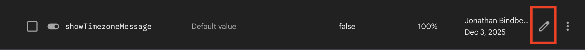
  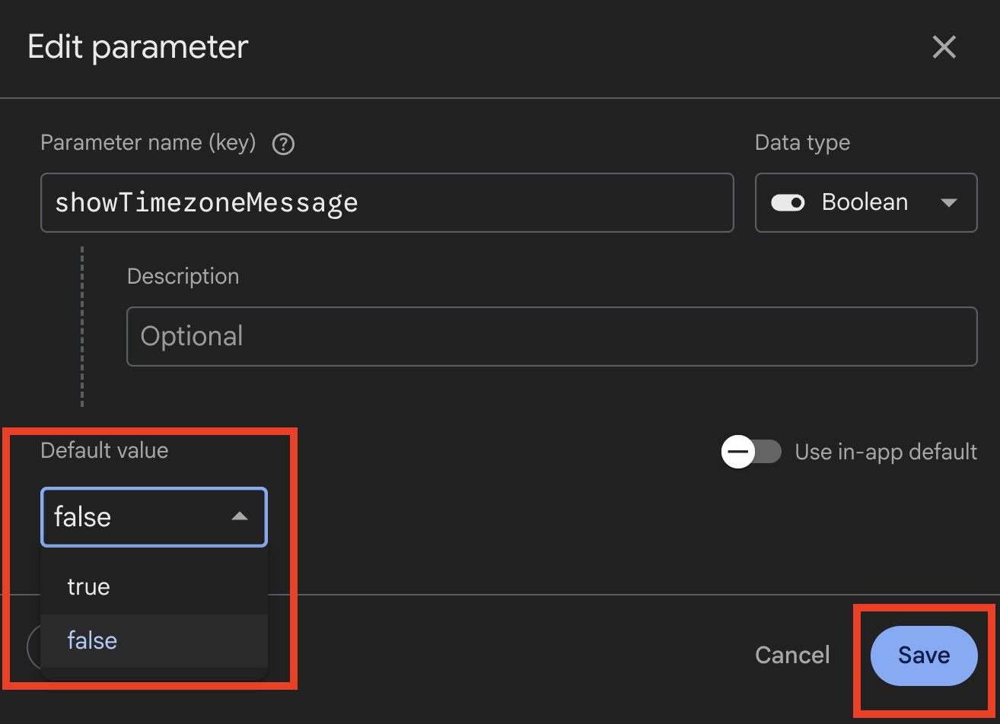
  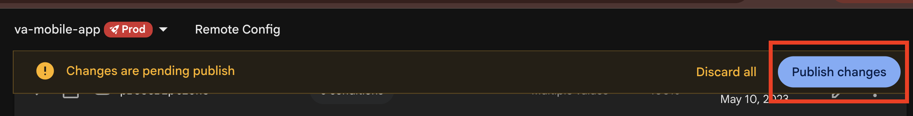

### Availability Framework

Availability framework is just a _fancier_ feature flag --- instead of a Boolean type, they are a JSON structure, and are tied directly to they waygateWrapper component which wraps every individual screen in the VA:HB Mobile App. There are three specific use cases for the level of interference we need to implement. You can read more about the [use cases here](../../../gettingStarted/AppFeatures/Availability%20Framework).

**JSON DISCLAIMER**
In order to get availability framework banners working in production, we need to put JSON into firebase. We've added some guardrails, but malformed JSON (ex: trailing commas) will cause crashes in the app. As a best practice, copy-paste from the known-to-work JSON below, and immediately double-check the functionality in the app, when setting this for a screen that's in production.

| Use Case                                                    | JSON Sample - See Disclaimer Above                                                                                                                                                                                                                                                                                                                 |
| ----------------------------------------------------------- | -------------------------------------------------------------------------------------------------------------------------------------------------------------------------------------------------------------------------------------------------------------------------------------------------------------------------------------------------- |
| Use Case 1 (deny access)                                    | \{"enabled": false, "errorMsgTitle": "The app isn't working right now", "errorMsgBody": "While we fix the problem, you can still get your VA health and benefits information on VA.gov.", "type": "DenyAccess"\}                                                                                                                                   |
| Use Case 2 (deny content), not yet fixed:                   | \{"enabled": false, "errorMsgTitle": "We found a problem", "errorMsgBody": "We're sorry. We're fixing a problem we found [with/in this thing]. If you need help now with [the thing], call us.", "type": "DenyContent", "appUpdateButton": false\}                                                                                                 |
| Use Case 2 (deny content), with fix released:               | \{"enabled": false, "errorMsgTitle": "You need to update the app", "errorMsgBody": "We fixed a problem [with/in this thing]. But to use this tool again, you need to update the app. If you need help now with [the thing], call us.", "type": "DenyContent", "appUpdateButton": true\}                                                            |
| Use Case 3 (allow content and function), not yet fixed:     | \{"enabled": false, "errorMsgTitle": "You may have trouble with [explain the thing]", "errorMsgBody": "We're fixing a problem [with/in this thing] that's affecting some Veterans. If you can't use [the thing] and need help now, call us.", "type": "AllowFunction", "appUpdateButton": false\}                                                  |
| Use Case 3 (allow content and function), with fix released: | \{"enabled": false, "errorMsgTitle": "You may need to update the app", "errorMsgBody": "We've fixed a problem some Veterans were having [with/in this thing]. If you're still having trouble using this tool, you may need to update the app. If you need help now with [the thing], call us.", "type": "AllowFunction", "appUpdateButton": true\} |

To implement an availability framework alert:

- Go to the [firebase console](https://console.firebase.google.com/u/2/project/va-mobile-app/config/env/firebase?hl=en_US)
- Most likely you'll need to create a new remote config parameter. (Picture 1)
- The name of the parameter needs to be WG_NameOfScreen, and you'll want to confirm the screen name via the relevant stack.(Picture 2)
- Consider isolating the framework to only the OS/Versions that are applicable to minimize exposure if possible.(Picture 3)
- Use the above table as a default then update the content accordingly for the situation. (Picture 3)

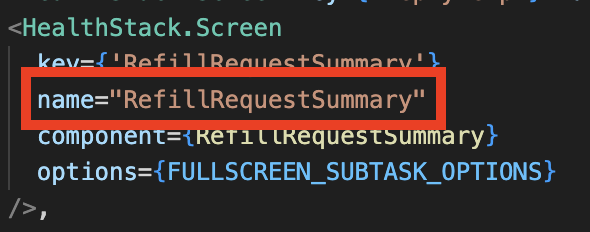
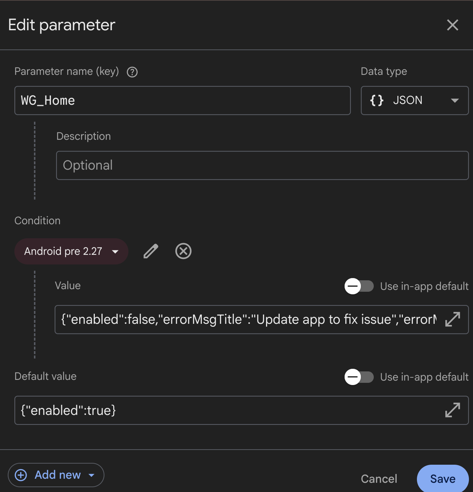

### Halting Release

There may be times where we need to halt the release to the app stores. In order to do this, we will need to go to the respective app stores to stop the release.

#### Stopping Android release

> **⚠️ IMPORTANT: ⚠️**

> **You will need to be an admin to complete this next step. You will also need access to the Google Play Console.**

**1.1** Once logged into the google play console, navigate to the app. VA: Health and Benefits. Click on `Test and Release`.
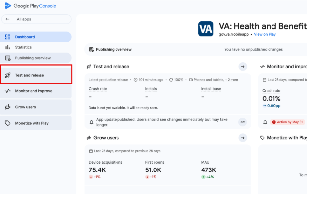

**1.2** Next, click on `Production`.

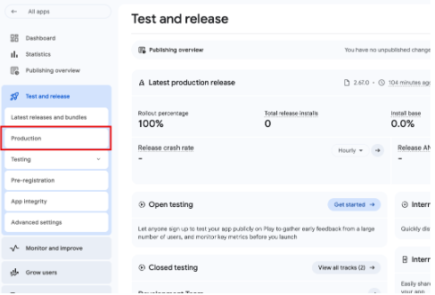

**1.3** Click on the `Releases` tab.

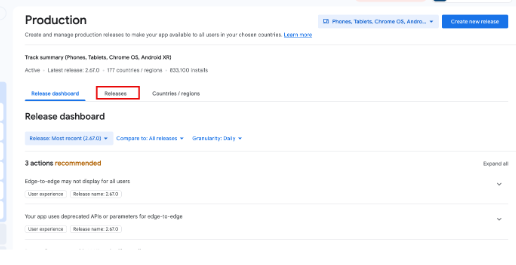

**1.4** On the most current release, click `Manage Release`.

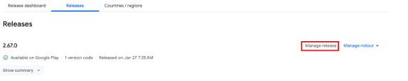

**1.5** On the release page, click `Halt rollout`.

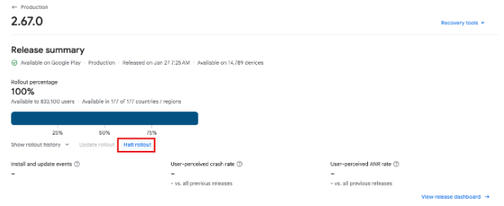

**1.6** The current Android release will now be stopped. If `2.67.0` is the current release in question, it will be removed from the store and it will revert to the previous release (in this case `2.66.0`) Now would be a good time to trigger [Availability Framework](#availability-framework) to target the install base for the release in question (`2.67.0`) and tell the users to uninstall and reinstall.

#### Stopping iOS release

**2.1** Currently we are unable to halt the iOS release like we can with the Android release. The ios app is released at 100% as soon as the go-live workflow runs. The only way to stop this release is to push out another release to supersede it.

## Plays

- [App Crash](#app-crash)
- [General Identity](#general-identity)
- [SSOe OAuth](#ssoe-oauth)
- [DNS](#dns)
- [App Store Admin Tasks](#app-store-admin-tasks)

### App Crash

App crashes occur for a wide variety of reasons with a wide variety of consequences. Some must be immediately addressed, while others can wait to be fixed until the next on-cycle deploy.

#### Manifestation

Problems usually manifest themselves as Veterans not being able to see their data once they're signed in, or as Veterans seeing the wrong data.

#### Detection

For these types of identity problems, we may be:

- [Crashlytics](https://console.firebase.google.com/u/2/project/va-mobile-app/crashlytics/app/android:gov.va.mobileapp/issues?state=open&time=last-seven-days&types=crash&tag=all&sort=eventCount) alerting.
- Alerted by the call center
- Informed of the issue in an app review
- Told of the issue through Slack

#### Correction

1. Triage the crash: determine how widespread the crash is, which platforms it occurs on, and whether it's specific to a few devices or all. Determine if the fix can be done through the backend, or if the app must be updated.
2. For a crash that impacts more than 3% of users on any platform, alert the Product Owner. (It's probably a good idea to alert the Product Owner of any recurring crash that happens more than a few times, but officially alert the Product Owner in the case of 3%.)
3. If the crash is related to bad data on the API side, fix the issue and, if necessary, request an out-of-band deploy to get the fix in place.
4. If the crash is related to the app itself, use the [severity scale](https://department-of-veterans-affairs.github.io/va-mobile-app/docs/QA/QualityAssuranceProcess/#issue-severity) determine your next steps.
   - If the crash is SEV-3 it may be worth waiting until the next release to fix the issue.
   - If the crash is SEV-2 it's worth fixing with an off-cycle release of the app.
   - If the crash is SEV-1 temporarily removing the app from sale should be a strong consideration. This is especially true if the crash is detected immediately following a deploy, or is somehow corrupting the device.
5. Fix the issue, test the fix, and redeploy the fix as an off-cycle app deploy if necessary. Do not make things worse by releasing another broken version.

_For widespread or catastrophic crashes, consider rebuilding and retesting the last previous stable version, and uploading that version to the store to replace the crashing version. This is often the fastest choice, and will give you time to more thorougly address the crash._

### General Identity

Identity across the VA is complicated, and identity issues may manifest themsleves in many ways. For example, problems may manifest as Veterans not being able to see their data once they're signed in, or as more complex scenarios where the wrong data is shown for a Veteran. This section addresses general identity issues; those specific to SSOe OAuth are covered in another play.

#### Manifestation

Problems usually manifest themselves as Veterans not being able to see their data once they're signed in, or as Veterans seeing the wrong data.

#### Detection

For these types of identity problems, we may be:

- Alerted by the call center
- Informed of the issue in an app review
- Told of the issue through Slack / Teams

#### Correction

These issues will generally be one-off and specific to individual Veterans. However, if there is a larger identity issue that we are the first to find, be sure to alert the Product Owner, post in #identity-support Slack channel, and follow up with a wider audience.

- Isolate the problem. Is it specific to an individual, a group, or all Veterans? Is it specific to the mobile app, or a va.gov-wide issue? Try to collect all the information you can.
- Alert the Product Owner and post the issue in #identity-support Slack channel. Be sure to add enough specifics that they can triage, but _do not_ post PII (Personal Identifiable Information) in Slack.
- If this issue happens outside of normal business hours and you deem it critical, you may post in the #oncall channel.
- If the issue is widespread or could result in the exposure of Veterans data, alert a wider audience immediately. This should include the Product Owner and VA engineers.

### SSOe OAuth

SSOe OAuth issues are a fairly common occurrence. They usually manifest themselves by one or more credential types not being able to sign in.

#### Manifestation

Problems usually manifest themselves by one or more credential types not being able to sign in.

#### Detection

You may detect the problem in one of many ways, including (but not limited to):

- Getting notified in the #va-mobile-app-alerts channel on Slack
- Seeing a lack of authentications for one or more credentials in our logs / monitoring software
- Receiving a notice that users are having trouble signing in
- Reading bad reviews on the app stores

#### Correction

- Check the #identity-support slack channel to see if there are widespread or known issues. If so, alert the Product Owner and continue to monitor the situation.
- If the problem is not widespread, alert the Product Owner and begin your investigation:
  - Have we changed anything lately that would impact logging in? Since we use SSOe OAuth, the answer is usually no. But perhaps we made some backend changes we should investigate.
- At the point we've determined we've not made any changes that would impact login, use Slack to escalate to the Indentity team.

### DNS

Though rare, we do encounter DNS issues from time to time. They manifest in many different ways that are almost impossible to
predict. But when it's DNS, you'll know it.

#### Manifestation

Almost impossible to predict. You'll know, usually when all else fails to fix the problem. Often DNS issues impact a much wider audience than just our app. In those cases, you'll see complaints appear in multiple channels in Slack.

#### Detection

You may detect the problem in one of many ways, including (but not limited to):

- Seeing widespread access issues
- Seeing problems that aren't solvable in any other ways

#### Correction

Check the Slack to see if there are widespread or known issues. If so, alert the Product Owner and continue to monitor the situation.

- If the problem is not widespread, alert the Product Owner and begin your investigation.
- DNS issues fall under the purview of Gateway Ops. They are a small group with a huge amount of responsibility. Because of that, it's best to approach them with a lot of evidence that DNS is the problem.
- It is also important to note the lack of automation in Gateway Ops. So often issues are intermittent or regionalized.
- At the point you've collected enough data, contact Gateway Ops. They are on a rotational schedule, so if you contact one of them directly they'll tell you to use the generic email address. That is, VANSOCOperationsGateWay@va.gov. When you create a ServiceNow ticket with them, it'll need to get routed to: IO.NETWORK.NOC.TICGATEWAY.
- You _MUST_ be proactive and continue to push DNS or other Gateway Issues forward. They will not get resolved on their own.

### App Store Admin Tasks

There will be times where the App Store Admin (ios) will need to complete certain tasks. These tasks include but are not limited to:

- Accepting agreements
- Accepting disclosures

If any of these are pending, our app will not build. If you see any messages like the below, you will need to reach out to an App Store Connect Admin. We will not have to do this with Android builds.

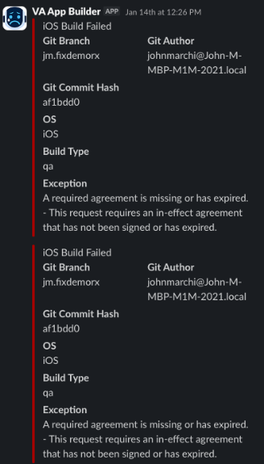
