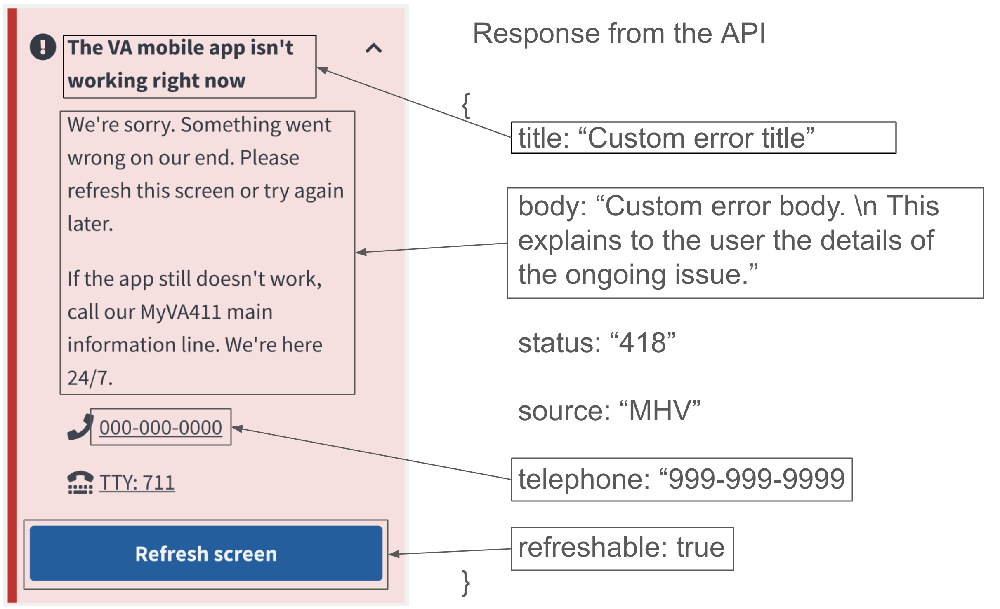

## How it works



When emergency custom error content is needed the backend will create a feature flag on the necessary endpoints in order to return a hardcoded response to the the frontend. The frontend will use the status code to know when the error content provided in the response should be combined with the existing error component. If you want to use this feature reach out to the Mobile API team in #va-mobile-app in Ad Hoc or OCTO slack.

Characteristics of the response:

- `title`: custom string provided by content to fill the bold title portion of the frontend error component
- `body`: custom string provided by content to fill the body of the error component. The frontend is prepared to respect `\\n` for new lines in this string, as well as apostrophes.
- `status`: will always be 418
- `source`: upstream system associated with the endpoint
- `telephone`: sting providing a custom phone number 
- `refreshable`: boolean telling the frontend to show or hide the refresh button

## Implementation

### Feature toggle

When building a custom error it will need to be set behind a feature flag to allow for the error to be enabled and disabled quickly and without code changes. For guidance on how to create feature toggles in the API please see the [Platform Developer Docs](https://depo-platform-documentation.scrollhelp.site/developer-docs/feature-toggles-guide#FeatureTogglesGuide-Addinganewfeaturetoggle(backend)).

When naming your feature flag, prefix with `mobile_custom_error_*` to avoid confusion and allow for easy grouping of all the current custom errors.

### Sending the error

The Custom Error is defined in `.../modules/mobile/lib/mobile/v0/exceptions/custom_errors.rb` in the Vets-API code base. When needed, a simple code change to any endpoint that requires a custom error to be sent can be implemented by raising this custom error with the appropriate fields set. Usually, this error should be checked and raised at the beginng of the controller endpoint and shortcircuit a response. For example:

In `example_controller.rb`:
```ruby
def index
    # custom error should be raised immediately within the endpoint unless the
    # error should be raised due to an edge case of the endpoint logic
    raise_custom_error
    # the rest of the endpoint code follows
    # ...
end

def raise_custom_error
    if Flipper.enabled?(:mobile_custom_error_example)
        raise Mobile::V0::Exceptions::CustomErrors.new(
            title: 'Custom error title',
            body: 'Custom error body. \n This explains to the user the details of the ongoing issue.',
            source: 'VAOS',
            telephone: '999-999-9999',
            refreshable: true
          )
    end
end
```

We recommend also adding a releveant spec to verify the error is being raised as intended.

In `example_controller_spec.rb`:
```ruby
context 'when custom error is enabled' do
    before do
        # enable the error for the test by forcing the flag
        allow(Flipper).to receive(:enabled?).with(:mobile_custom_error_example).and_return(true)
    end

    it 'raises a 418 custom error' do
        get '/mobile/v0/example', headers: sis_headers
        expect(response).to have_http_status(418)
        expect(response.parsed_body).to eq({ 'errors' => [{ 'title' => 'Custom error title',
                                                              'body' => 'Custom error body. \\n This explains to ' \
                                                                        'the user the details of the ongoing issue.',
                                                              'status' => 418,
                                                              'source' => 'VAOS',
                                                              'telephone' => '999-999-9999',
                                                              'refreshable' => true }] })
    end
end
```