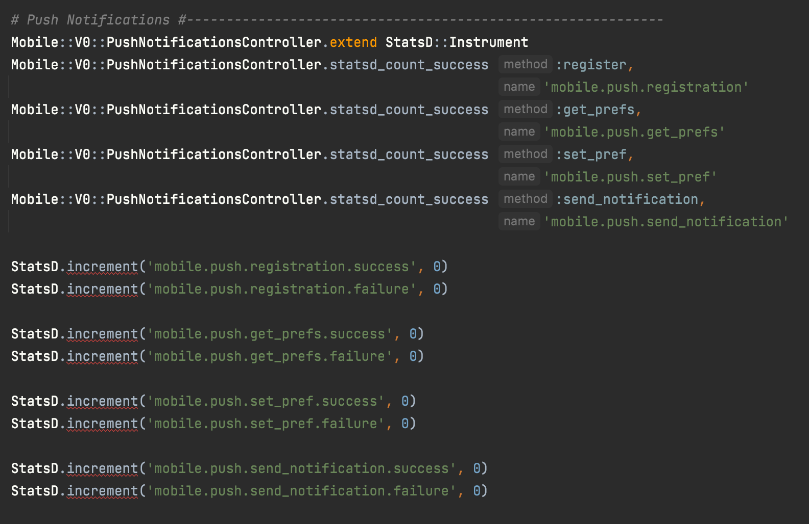
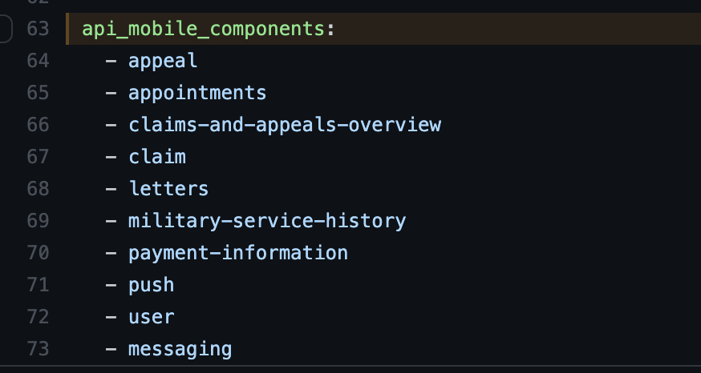

You can create custom Mobile metrics within Vets API by adding new statsd entries to `modules/mobile/config/initializers/statsd.rb`.



[Read more about Statsd](https://github.com/Shopify/statsd-instrument). In order for metrics to be picked up an entry for the associated endpoint must also be in `ansible/deployment/config/revproxy-vagov/vars/nginx_components.yml` in the [DevOps repo](https://github.com/department-of-veterans-affairs/devops)



## Cardinality

When adding StatsD metrics, keep metric tags **low-cardinality**, meaning the tag should have a small, bounded set of possible values (e.g., status codes, form types, regions). Tagging metrics with high-cardinality values like `claim_id`, `user_id`, or `request_id` creates a new time series for every unique value, causing the metrics database to grow unboundedly and dashboards to time out.

**Use metrics for aggregation, logs for details:**

```ruby
# Good: low-cardinality tags only
StatsD.increment('mobile.claim.submitted', tags: ["status:#{claim.status}"])

# Bad: high-cardinality tag creates unbounded time series
StatsD.increment('mobile.claim.submitted', tags: ["claim_id:#{claim.id}"])

# Instead, log the high-cardinality data
Rails.logger.info('Claim submitted', claim_id: claim.id, status: claim.status)
```

For a detailed explanation with real examples from vets-api, see the Watchtower SRE playbook:
[Metrics vs Logs Cardinality](https://github.com/department-of-veterans-affairs/octo_watchofficer/blob/main/docs/playbook/error-handling/18-metrics-vs-logs-cardinality.md)
