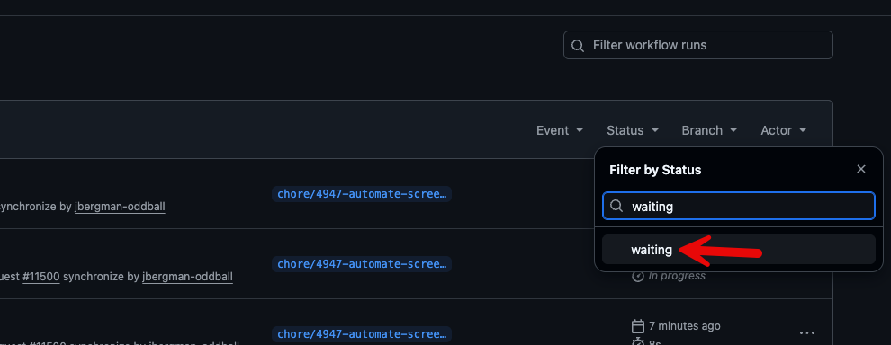

There may be some times that we need to scan packages that are being added to the repo to verify their contents and source. Below are the steps for some of the packages we may need to scan.

## package.json

Currently any changes that are made to any `package.json` files are reviewed before a merge is to happen. Upon approval, the rest of the scanning will complete. If the security-scan workflow detects a `package.json` change, it will pass the workflow to the bypass-packag-check environent check. When this happens, a team is alerted that a package needs to be reviewed.

### npm review

The package will need to be checked against the npm listing for it. For this we can use `npm info`.

```bash
npm info @testing-library/jest-dom

@testing-library/jest-dom@6.9.1 | MIT | deps: 6 | versions: 82
Custom jest matchers to test the state of the DOM
https://github.com/testing-library/jest-dom#readme

keywords: testing, dom, jest, jsdom

dist
.tarball: https://registry.npmjs.org/@testing-library/jest-dom/-/jest-dom-6.9.1.tgz
.shasum: 7613a04e146dd2976d24ddf019730d57a89d56c2
.integrity: sha512-zIcONa+hVtVSSep9UT3jZ5rizo2BsxgyDYU7WFD5eICBE7no3881HGeb/QkGfsJs6JTkY1aQhT7rIPC7e+0nnA==
.unpackedSize: 300.9 kB

dependencies:
@adobe/css-tools: ^4.4.0      aria-query: ^5.0.0            css.escape: ^1.5.1            dom-accessibility-api: ^0.6.3 picocolors: ^1.1.1            redent: ^3.0.0

maintainers:
- testing-library-bot <testinglibraryoss@gmail.com>
- kentcdodds <me@kentcdodds.com>
- timdeschryver <timdeschryver@outlook.com>
- patrickhulce <patrick.hulce@gmail.com>
- dfcook <dfcook@hotmail.com>
- gpx <polvara@gmail.com>
- mpeyper <mpeyper7@gmail.com>
- mihar-22 <rahim.alwer@gmail.com>
- pago <patrick.gotthardt@trivago.com>
- cmckinstry <carson.mckinstry@gmail.com>
- thymikee <thymikee@gmail.com>
- brrianalexis <brrianalexis.dev@gmail.com>
- jdecroock <decroockjovi@gmail.com>
- mdjastrzebski <mdjastrzebski@gmail.com>
- eps1lon <silbermann.sebastian@gmail.com>
- phryneas <mail@lenzw.de>
- matanbobi <matanbobi@gmail.com>

dist-tags:
beta: 5.7.0-beta.1  latest: 6.9.1

published 4 months ago by testing-library-bot <testinglibraryoss@gmail.com>

```

### Guarddog Scan

After the `npm info` check we run a python package called `guarddog`. `guarddog` is maintained my DataDog and it checks for malicious packages. [GitHub Link](https://github.com/DataDog/guarddog). To make this easy I have installed `uv` which is a pyton package and project manager. Instead of installing python packages, I leverage `uvx` which runs the package on-demand. I have created an alias called `check` that will run the package scan and output the results.

```bash
check is an alias for uvx guarddog npm scan

check @testing-library/jest-dom
Installed 79 packages in 166ms

Found 0 potentially malicious indicators scanning @testing-library/jest-dom

```

### Results

Once you have the results, locate the job that is waiting for the approval. You can find this on the [Actions](https://github.com/department-of-veterans-affairs/va-mobile-app/actions) page of the repo.


Click on the `Status` option and type in `waiting`.


