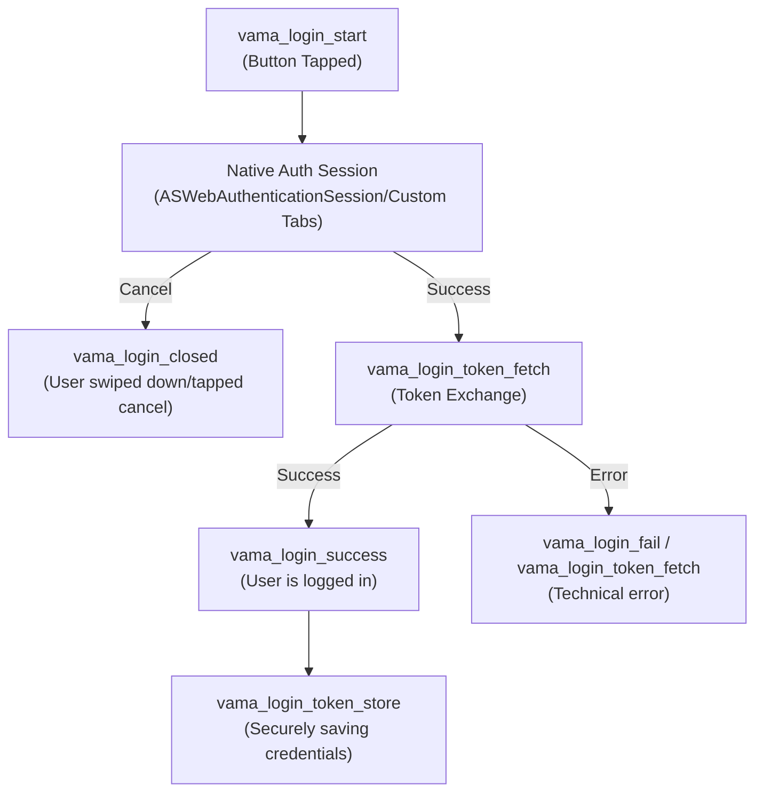

# Single sign-on

Single sign-on (SSO) allows users to access the VA.gov website within the mobile app without having to manually authenticate in the browser.

## Architecture

The SSO process begins with the normal [authentication flow](../BackEnd/Architecture/Auth%20Diagrams.md), with the user signing in via the login screen. When the user taps the `Sign in` button, the mobile app launches the website's login webpage (https://va.gov/sign-in) in the browser. This webpage is opened with query parameters attached to the URL, specifically `code_challenge_method`, `code_challenge`, `application`, and `oauth`. In order to have the ability to start SSO sessions, we pass an additional query parameter to the URL, `scope`, which is set to `device_sso`. This informs the https://api.va.gov/v0/sign_in/authorize API endpoint that's called by the website that in addition to returning an access token and refresh token, it should return a device secret (`device_secret`), which can be used to fetch cookies for starting SSO sessions.

Once the device secret is received, it is securely stored in Keychain (iOS) or Keystore (Android).

### Fetching SSO cookies

To start an SSO session, cookies need to be fetched using the device secret and access token. SSO cookies are fetched from the https://api.va.gov/v0/sign_in/token endpoint with a few parameters, most importantly `subject_token` (access token) and `actor_token` (device secret). This endpoint will return a response with the `Set-Cookie` header, which will contain the SSO cookies `vagov_access_token`, `vagov_refresh_token`, `vagov_anti_csrf_token`, and `vagov_info_token`. Once received, these cookies are stored in the `CookieManager` using `@react-native-cookies/cookies`, and can be used to authenticate the user's session in the WebView. Cookies are fetched when the WebView component is first mounted. (Note: The `useSSO` prop must be passed to the WebView component in order for SSO cookies to be fetched.)

New cookies are always fetched whenever a new WebView is launched in the app. This is to ensure the SSO cookies used in the WebView are not expired.

### Authenticating the WebView

Once the SSO cookies are stored in the `CookieManager`, the `hasSession` field is set to `true` in `localstorage` for the WebView. This allows the VA.gov website to recognize that the user's session is authenticated.

### Persisting the device secret

As mentioned above, the device secret is stored in Keychain/Keystore to ensure its persistence for biometric login. When a user logs into the app with biometrics, the app will use the stored device secret to start SSO sessions. The device secret has an expiration of 45 days, similar to the refresh token.

When the user manually signs out, all sessions spawned with the device secret are revoked via the https://api.va.gov/v0/sign_in/revoke API endpoint. Likewise, whenever the user manually signs in to the mobile app, a new device secret will be retrieved and stored.

## Usage

SSO sessions can easily be started in WebViews within the app. Whenever you have a link/button that navigates to the WebView screen, you can pass the `useSSO` prop to the screen to start an authenticated SSO session, e.g.

```
navigateTo('Webview', {
  url: LINK_TO_OPEN_IN_WEBVIEW,
  displayTitle: t('webview.vagov'),
  useSSO: true,
})
```

## Analytics and Error Logging

### Analytics Event Dictionary

| Event Name | Parameter(s) | Trigger / Description | High-Level Significance |
| :--- | :--- | :--- | :--- |
| [`vama_login_start`](https://analytics.google.com/analytics/web/?authuser=0&hl=en-US#/a50123418p265787033/reports/dashboard?params=_u..insightCards%3D%5B%7B%22question%22:%22notification_receive%22%7D%5D%26_u..nav%3Dmaui%26_r..dimension-value%3D%7B%22dimension%22:%22eventName%22,%22value%22:%22vama_login_start%22%7D&collectionId=user&r=events-overview) | `sis` (string), `p1` (biometric: string) | User taps 'Sign In'. `p1` indicates if it started via biometrics. | **Top of Funnel.** Tracks intent to log in. |
| [`vama_login_success`](https://analytics.google.com/analytics/web/?authuser=0&hl=en-US#/a50123418p265787033/reports/dashboard?params=_u..insightCards%3D%5B%7B%22question%22:%22notification_receive%22%7D%5D%26_u..nav%3Dmaui%26_r..dimension-value%3D%7B%22dimension%22:%22eventName%22,%22value%22:%22vama_login_success%22%7D&collectionId=user&r=events-overview) | `sis` (string) | Final step: Tokens validated and app state updated to 'logged in'. | **Success Metric.** Conversion endpoint. |
| [`vama_login_fail`](https://analytics.google.com/analytics/web/?authuser=0&hl=en-US#/a50123418p265787033/reports/dashboard?params=_u..insightCards%3D%5B%7B%22question%22:%22notification_receive%22%7D%5D%26_u..nav%3Dmaui%26_r..dimension-value%3D%7B%22dimension%22:%22eventName%22,%22value%22:%22vama_login_fail%22%7D&collectionId=user&r=events-overview) | `error` (string), `sis` (string) | General failure catch-all in the thunk layer. | **Churn Point.** Technical failure during the flow. |
| [`vama_login_closed`](https://analytics.google.com/analytics/web/?authuser=0&hl=en-US#/a50123418p265787033/reports/dashboard?params=_u..insightCards%3D%5B%7B%22question%22:%22notification_receive%22%7D%5D%26_u..nav%3Dmaui%26_r..dimension-value%3D%7B%22dimension%22:%22eventName%22,%22value%22:%22vama_login_closed%22%7D&collectionId=user&r=events-overview) | `sis` (string) | User cancelled the login session (e.g., swiped down on iOS WebView). | **Abandonment.** Friction or change of mind. |
| [`vama_login_token_fetch`](https://analytics.google.com/analytics/web/?authuser=0&hl=en-US#/a50123418p265787033/reports/dashboard?params=_u..insightCards%3D%5B%7B%22question%22:%22notification_receive%22%7D%5D%26_u..nav%3Dmaui%26_r..dimension-value%3D%7B%22dimension%22:%22eventName%22,%22value%22:%22vama_login_token_fetch%22%7D&collectionId=user&r=events-overview)| `error` (string) | *Optional:* Fired only if the POST to exchange the code for tokens fails. | **Integration Error.** Failure communicating with SIS. |
| [`vama_login_token_refresh`](https://analytics.google.com/analytics/web/?authuser=0&hl=en-US#/a50123418p265787033/reports/dashboard?params=_u..insightCards%3D%5B%7B%22question%22:%22notification_receive%22%7D%5D%26_u..nav%3Dmaui%26_r..dimension-value%3D%7B%22dimension%22:%22eventName%22,%22value%22:%22vama_login_token_refresh%22%7D&collectionId=user&r=events-overview)| `error` (string) | Fired when an automatic session refresh (using refresh token) fails. | **Silent Friction.** Can cause forced logouts. |
| [`vama_login_token_store`](https://analytics.google.com/analytics/web/?authuser=0&hl=en-US#/a50123418p265787033/reports/dashboard?params=_u..insightCards%3D%5B%7B%22question%22:%22notification_receive%22%7D%5D%26_u..nav%3Dmaui%26_r..dimension-value%3D%7B%22dimension%22:%22eventName%22,%22value%22:%22vama_login_token_store%22%7D&collectionId=user&r=events-overview) | `p1` (boolean: success) | Result of saving the refresh token to the phone's secure keychain. | **Persistence.** If `false`, user must re-log every session. |

A funnel report showing Sign In Screen > Login Clicked > Login Success can be found [here](https://analytics.google.com/analytics/web/?authuser=0&hl=en-US#/analysis/a50123418p265787033/edit/mCUZMmnjSwqKhd1sAHXLKA).

---

### Technical Architecture Overview

The app uses a **PKCE (Proof Key for Code Exchange)** flow. The sequence involves a native bridge to launch a secure web session, followed by a token exchange in the Redux layer.

#### The Auth Funnel




---

### Firebase Error Logging (Non-Fatal)

For engineers, these are logged to Firebase Crashlytics to monitor stability without crashing the app. Each context is linked to the corresponding non-fatal crashes logged in Firebase. Non-linked contexts do not have any errors recorded.

| Context / Location | Related Analytics Event | Criticality |
| :--- | :--- | :--- |
| `useStartAuth` ([iOS](https://console.firebase.google.com/u/1/project/va-mobile-app/crashlytics/app/ios:gov.va.vamobileapp/issues/c4ce01096692cad0fb78c9d9d7d80e84?time=7d&types=error&sessionEventKey=10041e7798954fb3abc1803fd2525ae6_2181529978720581895) / [Android](https://console.firebase.google.com/u/1/project/va-mobile-app/crashlytics/app/android:gov.va.mobileapp/issues/1295773f5b63e45c3f311b82c34d3c30?time=7d&types=error&sessionEventKey=6983A8D30264000134BA1C46AFC9A6E8_2181551896884322774)) | `vama_login_fail` | **High.** Bridge failures before the webview even succeeds. |
| `handleTokenCallbackUrl` ([iOS](https://console.firebase.google.com/u/1/project/va-mobile-app/crashlytics/app/ios:gov.va.vamobileapp/issues/e808c65d18e51bec66f055f3dbf002ef?time=7d&types=error&sessionEventKey=da43505772924a9ea74aae91496a889d_2181541855874107418) / [Android](https://console.firebase.google.com/u/1/project/va-mobile-app/crashlytics/app/android:gov.va.mobileapp/issues/0179da25d46b68745e5d5b62f09ced83?time=7d&types=error&sessionEventKey=6982827602E3000119BEE52CD36BF288_2181228422040370756)) | `vama_login_token_fetch` | **High.** Token exchange failure (expired code, network). |
| `attemptIntializeAuthWithRefreshToken` ([iOS](https://console.firebase.google.com/u/1/project/va-mobile-app/crashlytics/app/android:gov.va.mobileapp/issues?time=7d&types=error&issuesQuery=attemptIntializeAuthWithRefreshToken&state=open&tag=all&sort=eventCount) / [Android](https://console.firebase.google.com/u/1/project/va-mobile-app/crashlytics/app/android:gov.va.mobileapp/issues/a820bfdba6cf9bf722175ff4b908c570?time=7d&types=error&sessionEventKey=69828D4701D900012A62DD7ADA1F6359_2181240071785751661)) | `vama_login_token_refresh` | **Medium.** Automatic re-login failed. |
| `processAuthResponse` ([iOS](https://console.firebase.google.com/u/1/project/va-mobile-app/crashlytics/app/ios:gov.va.vamobileapp/issues/29274b46efe6d5c8bc0ad89acffa014b?time=7d&types=error&sessionEventKey=5ccb4a99c1174646aa54a42f18514f5c_2181556965848438930) / [Android](https://console.firebase.google.com/u/1/project/va-mobile-app/crashlytics/app/android:gov.va.mobileapp/issues/8e24270311813b2f0930d3fc2e073c7b?time=7d&types=error&sessionEventKey=69828DDF02A600011429F448B83A9F0F_2181240766511718372)) | `vama_login_token_fetch` / `_refresh` | **High.** API returned unexpected data format. |
| `saveRefreshTokenWithBiometrics` (No errors logged) | `vama_login_token_store` | **Low.** Keychain storage issue (hardware/permissions). |
| `logout` ([iOS](https://console.firebase.google.com/u/1/project/va-mobile-app/crashlytics/app/ios:gov.va.vamobileapp/issues/2c225f79f828f80c94ba9aa20428e9cc?time=7d&types=error&sessionEventKey=5b78febd5b644b2185a2ba570c0766f4_2181549372354610396) / [Android](https://console.firebase.google.com/u/1/project/va-mobile-app/crashlytics/app/android:gov.va.mobileapp/issues/c1bb601ec142644b996c5e6151743f65?time=7d&types=error&sessionEventKey=69822FC901A000013695B1F2C1FBACA6_2181146138173953190)) | N/A | **Low.** Error clearing tokens from the phone. |


This will open the WebView screen with an SSO session, allowing the user to access features on the website that require authentication.

## API documentation

For more information on API usage for SSO, view the [Device SSO Token Exchange](https://github.com/department-of-veterans-affairs/va.gov-team/blob/master/products/identity/Products/Sign-In%20Service/Engineering%20Docs/Authentication%20Types/Client%20Auth%20(User)/auth_flows/device_sso_token_exchange.md) documentation.
