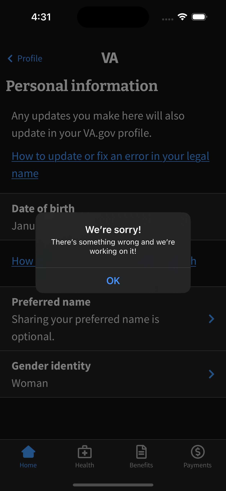
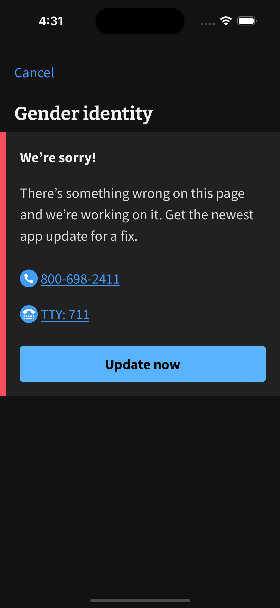
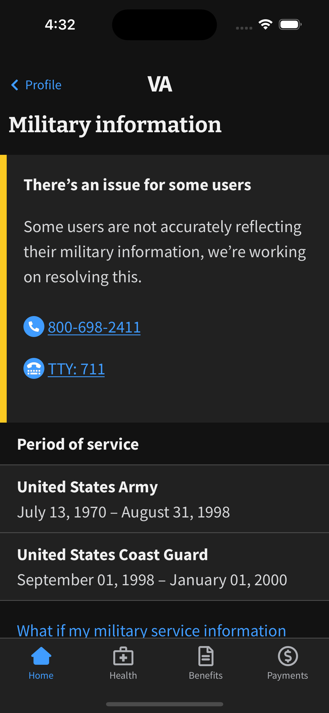
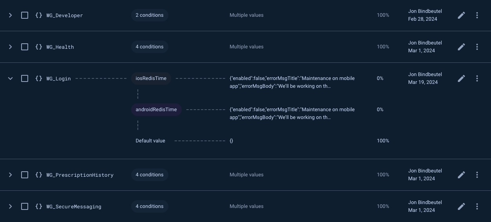

# Availability Framework

## Feature Summary

Given the limitations of app store release processes between iOS and Android, we have no way to quickly/instantly turnaround a fix for even an easily resolved problem. Best case scenario with an app store update labelled 'hotfix' is 24 hours which is a really painful amount of time for a meaningful part of the application to be unusable for a veteran. We need to implement a way to quickly react and notify our userbase to a critical problem with a feature, api, or the app as a whole. Availability Framework allows us to stop user navigation to a given screen with a popup message, allow navigation but replace the screen display with an informative alert, or simply tack on a warning alert at the top of existing screen functionality.

## Use Cases

* Use Case 1: A screen is broken (for all users) and it can’t be rendered without crashing the app/red screen of death.
* Use Case 2: A screen element, feature, or part of a feature is broken (for all users) and the feature entry point can still be accessed and screen rendered (with missing or bad data), and we want to prevent everyone from accessing the broken feature.
* Use Case 3: A screen element, feature, or part of feature is broken (for SOME users. not all) and the feature entry point can still be accessed screen rendered, but some folks will have critically broken data/feature.

## Example Screenshots

Use Case 1: 

Use Case 2: 

Use Case 3: 

## How to Enable

Here you'll see existing examples of previously enabled availability framework setups:

Firebase definitions: 

[JSON documentation and the parameter setup](https://github.com/department-of-veterans-affairs/va.gov-team/blob/master/products/va-mobile-app/Teams/QA%20and%20Release/Policies/Process%20-%20Availability%20Framework.md#json-disclaimer).

https://github.com/department-of-veterans-affairs/va.gov-team/blob/master/products/va-mobile-app/Teams/QA%20and%20Release/Policies/Process%20-%20Availability%20Framework.md

## Developer Notes

* If we run into an issue that requires ClaimsHistoryScreen to have an AF toggle, we will need to investigate doing the same for 'ClaimsHistory' for releases that happened in january if it's relevant to the scenario.
* All 'Else' clauses should be set to the default waygate configuration to avoid issues with the remote config developer setup.

Defaults:
  enabled: true,
  type: undefined,
  errorMsgTitle: undefined,
  errorMsgBody: undefined,
  appUpdateButton: false

* We should endeavor to avoid screen name changes at all costs to avoid duplicative AF requirements.
