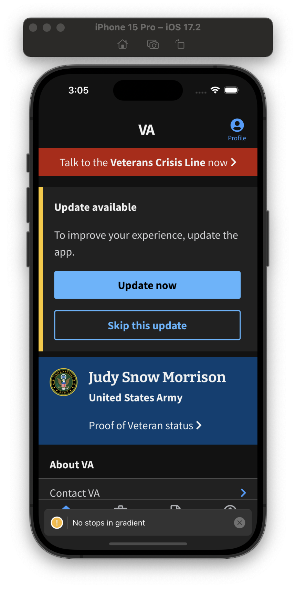

# Encouraged Update
 
## Feature Summary

Encouraged update displays to the veteran that there is a newer version in the app store to encourgage them to update with a button to click to either download in App update(Android) or to go to the app store to download(iOS). In doing so they will download the latest version of the app and have access to all of the benefits that come with it. We also gave them the option of skipping an update for a particular version which hides this alert until the next version is released. This alert takes priority over the Whats New alert.

This is potentially a precursor to forced upgrading in the future after so many versions of the app have gone by without upgrading. Currently there is no plan to have a forced upgrade feature, but the ability is there.

## Use Cases

* Use Case 1: The version on the device is older than what is in the store so it displays the encouraged update alert(see screenshot)
* Use Case 2: The version on the device is older than what is in the store and the veteran decided to skip encourage update for this version so it does not display the alert
* Use Case 3: The version on the device is the same version in the store or newer(updates from the app store role out to devices periodically so it is possible that they updated by the store api is returning to us a older version) so it displays the [Whats New](../WhatsNew/WhatsNew.md) alert if applicable

## Screenshot

