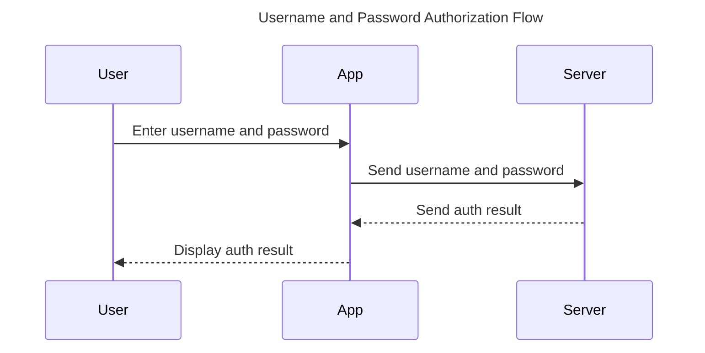
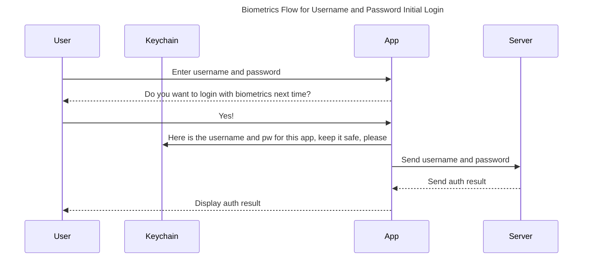
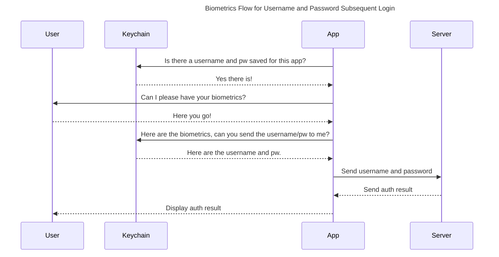
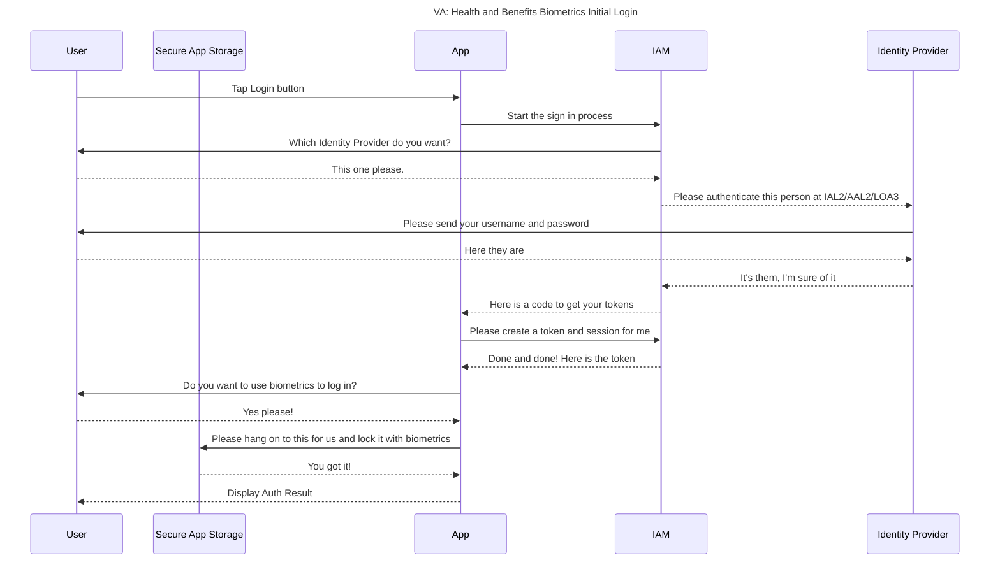
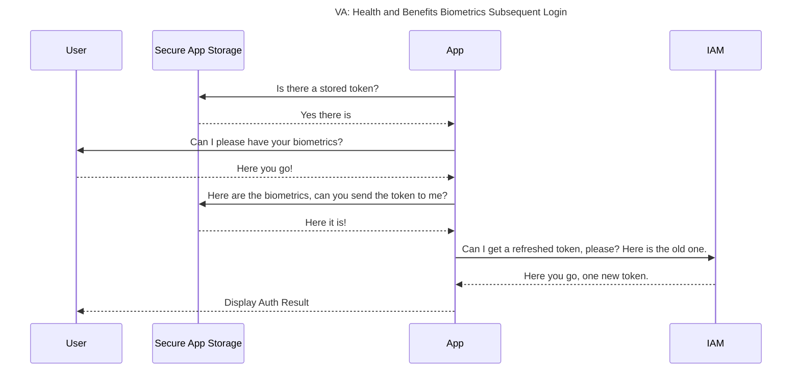

```mermaid
sequenceDiagram
    title: Username and Password Authorization Flow
    participant User
    participant App
    participant Server
    User->>App: Enter username and password
    App->>Server: Send username and password
    Server-->>App: Send auth result
    App-->>User: Display auth result
```

```mermaid
sequenceDiagram
    title: Biometrics Flow for Username and Password Initial Login
    participant User
    participant Keychain
    participant App
    participant Server
    User->>App: Enter username and password
    App-->>User: Do you want to login with biometrics next time?
    User->>App: Yes!
    App->>Keychain: Here is the username and pw for this app, keep it safe, please
    App->>Server: Send username and password
    Server-->>App: Send auth result
    App-->>User: Display auth result
```

```mermaid
sequenceDiagram
    title: Biometrics Flow for Username and Password Subsequent Login
    participant User
    participant Keychain
    participant App
    participant Server
    App->>Keychain: Is there a username and pw saved for this app?
    Keychain-->>App: Yes there is!
    App->>User: Can I please have your biometrics?
    User-->>App: Here you go!
    App->>Keychain: Here are the biometrics, can you send the username/pw to me?
    Keychain-->>App: Here are the username and pw.
    App->>Server: Send username and password
    Server-->>App: Send auth result
    App-->>User: Display auth result
```

```mermaid
sequenceDiagram
    title: VA: Health and Benefits Biometrics Initial Login
    participant User
    participant Secure App Storage
    participant App
    participant IAM
    participant Identity Provider
    User->>App: Tap Login button
    App->>IAM: Start the sign in process
    IAM->>User: Which Identity Provider do you want?
    User-->>IAM: This one please.
    IAM-->>Identity Provider: Please authenticate this person at IAL2/AAL2/LOA3
    Identity Provider->>User: Please send your username and password
    User-->>Identity Provider: Here they are
    Identity Provider-->>IAM: It's them, I'm sure of it
    IAM-->>App: Here is a code to get your tokens
    App->>IAM: Please create a token and session for me
    IAM-->>App: Done and done! Here is the token
    App->>User: Do you want to use biometrics to log in?
    User-->>App: Yes please!
    App->>Secure App Storage: Please hang on to this for us and lock it with biometrics
    Secure App Storage-->>App: You got it!
    App-->>User: Display Auth Result
```

```mermaid
sequenceDiagram
    title: VA: Health and Benefits Biometrics Subsequent Login
    participant User
    participant Secure App Storage
    participant App
    participant IAM
    App->>Secure App Storage: Is there a stored token?
    Secure App Storage-->>App: Yes there is
    App->>User: Can I please have your biometrics?
    User-->>App: Here you go!
    App->>Secure App Storage: Here are the biometrics, can you send the token to me?
    Secure App Storage-->>App: Here it is!
    App->>IAM: Can I get a refreshed token, please? Here is the old one.
    IAM-->>App: Here you go, one new token.
    App-->>User: Display Auth Result
```
