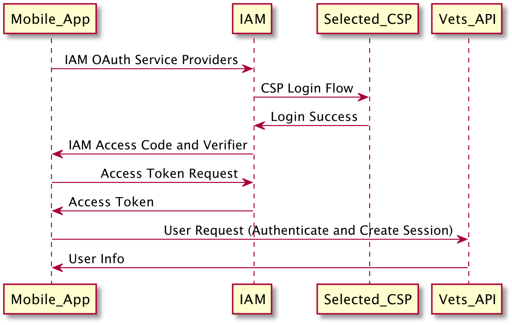
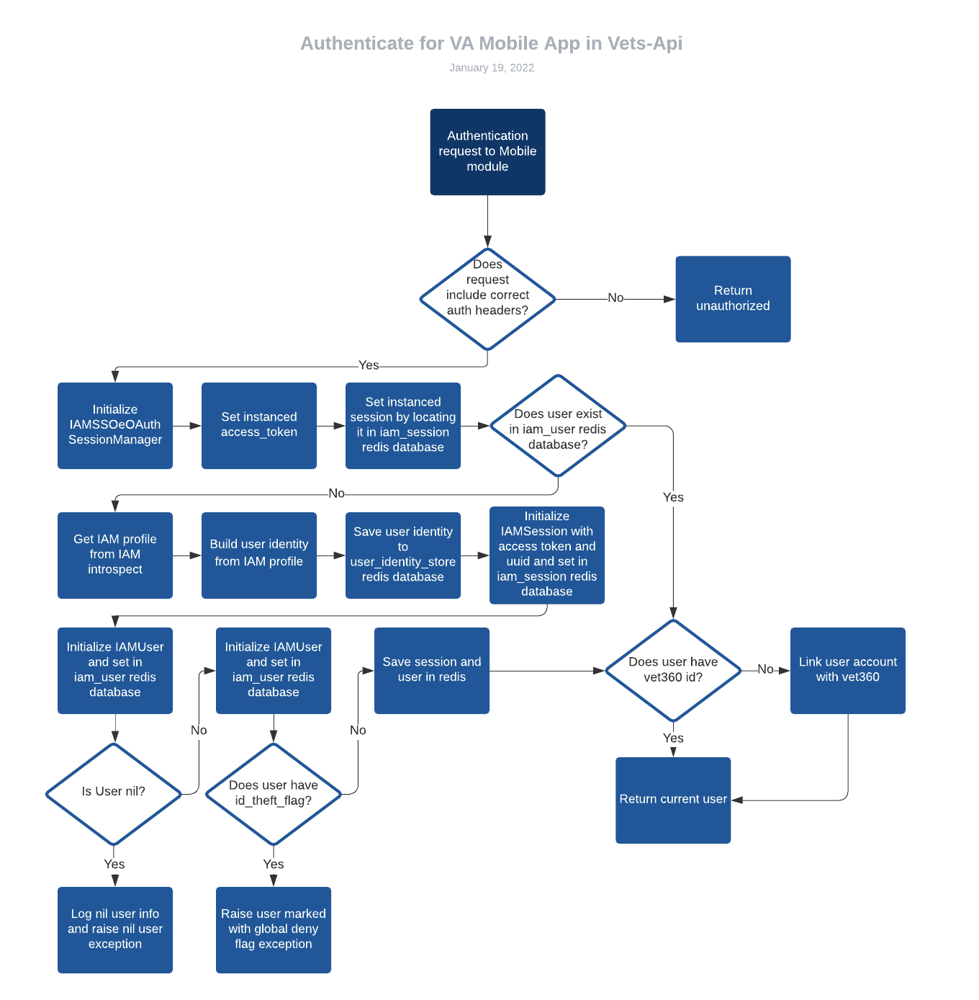

# IAM

## Authentication Sequence Diagram

## Vets-API Authentication Activity Diagram

## Provider Details

DSLogon - Oldest authentication method. Connected to DoD. Vets who already have this login info can use it to access services on VA.gov and Mobile that don't require MFA. 

MHV - Allows users to use their My HealtheVet credentials to utilize other services such as va.gov and our mobile app. Similar to DSLogon users, authenticating this way can't access services that require users to have MFA.

Id.me - Owned by a 3rd party company, paid for by the VA. Requires identity verification and MFA (via OTPs).

Login.gov - Newest authentication method. Recently built and owned by the VA. Requires identity verification and MFA (via many different options). Long term goal is to move everyone to login.gov so all users will be verified and the VA can stop paying for id.me

## Test Users

DSLogon - Currently we only have one DSL test user, Arfan Russel. The login password in for can be found in the VA Mobile 1Password under "DSlogon staging (claims)"

MHV - Users can be found here: [MHV test users](https://github.com/department-of-veterans-affairs/va.gov-team-sensitive/blob/master/Administrative/vagov-users/mhv-lower-env-test-accounts.md). Premium users are the only ones who work with the mobile app.

Id.me - Can be found here: [MVI staging test users](https://github.com/department-of-veterans-affairs/va.gov-team-sensitive/blob/master/Administrative/vagov-users/mvi-staging-users.csv) or can be found in the VA.gov 1Password vault under vets.gov.user+NNN@gmail.com where NNN is a number 1 to 3 digits long.

Login.gov - Located in the VA.gov 1Password vault. Can be found by searching "login.gov".