## Upstream Service Map

```mermaid
---
config:
  layout: dagre
  theme: neutral
  look: classic
---
graph LR
    subgraph Services[VA Mobile API Services]
        Appeals([Appeals])

        Claims([Claims])
        DisabilityRating([Disability Rating])
        PaymentInfo([Payment Info])

        Allergies([Allergies])
        Immunizations([Immunizations])

        LabsAndTests([Labs And Tests])
        Locations([Locations])
        Observations([Observations])

        Dependents([Dependents])
        Awards([Awards])
        PaymentHistory([Payment History])

        Letters([Letters])

        DecisionLetters([Decision Letters])
        Efolder([Efolder])

        Users([Users])
        Profile("Profile:
            Addresses
            Demographics
            Emails
            GenderIdentity
            MilitaryInformation
            Phones
            PreferredNames
        ")

        Appointments([Appointments])
        Clinics([Clinics/Facilities])
        CommunityCareEligibility([Community Care Eligibility])
        FacilitiesInfo([FacilitiesInfo])
        FacilityEligibility([Facility Eligibility])
        VeteransAffairsEligibility([Veterans Affairs Eligibility])

        Login([Login])

        Prescriptions([Prescriptions])
        Attachments([Attachments])
        Folders([Folders])
        Messages([Messages])
        Threads([Threads])
        TriageTeams([Triage Teams])

        Cemeteries([Cemeteries])
        PreneedsBurials([Preneed Burials])

        Debts([Debts])
        FinancialStatusReports([Financial Status Reports])

        CommunityCareProviders([Community Care Providers])

        EnrollmentStatus([Enrollment Status])
        Checkin([Check In])
        Pensions([Pensions])
        PushNotifications([Push Notifications])

    end
    
    subgraph Upstream[Upstream Services]
        Caseflow([Caseflow])
        VACOLS([VACOLS])
        subgraph Lighthouse
            LHBenefitsClaims([Benefits Claims API])
            LHVetService([Vet Service History and Eligibility API])
            %% LHLetters([VA Letter Generator API]) %% In Progress
            LHDirectDeposit([Direct Deposit Management API])
            LHVetHealth(["Veterans Health /
                Patient Health API (FHIR)"])
            LHBenefitsIntake([Benefits Intake API])
        end
        ArcGIS([ArcGIS])
        CDW([CDW])
        DEERS([DEERS])
        VAOS([VAOS])
        VistA([VistA])
        VEText([VEText])
        SIS([SIS])
        BGS([BGS])
        VBMS([VBMS])
        CorpDB([CorpDB])
        DSLogon([DSLogon])
        IDME([ID.ME])
        Logingov([Logingov])
        VAProfile([VAProfile])
        MPI([MPI])
        TooManyToList([Too Many To List])
        EVSS([EVSS])
        subgraph MHV
            RX(["RX (Prescriptions)"])
            SM(["SM (Secure Messaging)"])
        end
        CHIP([CHIP])
        BID([BID])
        DMC(["Debts Management Center (DMC)"])
        EOAS([EOAS/Preneeds])
        PPMS([PPMS])
        HCA(["Healthcare Application
            / Enrollment Eligibility"])
        APNsGCM([APNs/GCM])
        AWS([AWS])
    end

    classDef dashedBorder stroke-dasharray: 5 5, stroke-width: 2px
    
    Appeals --> Caseflow
    Caseflow --> VACOLS

    Claims --> LHBenefitsClaims
    DisabilityRating --> LHVetService
    Dependents --> LHBenefitsIntake
    PaymentInfo --> LHDirectDeposit
    %% Letters --> LHLetters # In Progress

    Allergies --> LHVetHealth
    Immunizations --> LHVetHealth
    LabsAndTests --> LHVetHealth
    Locations --> LHVetHealth
    Observations --> LHVetHealth

    Lighthouse ---> DEERS
    Lighthouse --> ArcGIS
    Lighthouse --> CDW
    Lighthouse ---> VBMS
    Lighthouse --> BGS

    Dependents --> VBMS
    Dependents --> BGS
    Awards --> BGS
    PaymentHistory --> BGS
    BGS --> CorpDB

    Letters --> EVSS
    EVSS --> BGS
    EVSS --> DEERS
    EVSS --> VBMS
    EVSS --> MPI
    
    DecisionLetters --> VBMS
    Efolder --> VBMS
    VBMS --> CorpDB
    VBMS --> MPI

    Users --> MPI
    
    Profile --> VAProfile
    VAProfile --> TooManyToList
    VAProfile --> MPI

    Appointments --> VAOS
    Clinics --> VAOS
    CommunityCareEligibility --> VAOS
    FacilitiesInfo --> VAOS
    FacilityEligibility --> VAOS
    VeteransAffairsEligibility --> VAOS
    VAOS --> MPI
    VAOS --> VistA
    
    Login --> SIS
    SIS --> MPI
    SIS --> DSLogon
    SIS --> IDME
    SIS --> Logingov
    
    Prescriptions --> RX
    Attachments --> SM
    Folders --> SM
    Messages --> SM
    Threads --> SM
    TriageTeams --> SM
    MHV --> MPI

    Cemeteries --> EOAS
    PreneedsBurials --> EOAS

    Debts --> DMC
    FinancialStatusReports --> DMC

    CommunityCareProviders --> PPMS
    EnrollmentStatus --> HCA
    Checkin --> CHIP
    Pensions --> BID
    
    PushNotifications ---> VEText
    VEText --> APNsGCM
    VEText --> AWS

```

Image: Diagram mapping all the upstream services used by the VA Mobile API

## Service Contacts

| Service    | Slack Channel                                                                                                                                                                                         | Contacts                                  |
| ---------- | ----------------------------------------------------------------------------------------------------------------------------------------------------------------------------------------------------- | ----------------------------------------- |
| BID   | n/a                                                                                                                                 | n/a                                       |
| Caseflow   | [#caseflow-support-team](https://dsva.slack.com/archives/C0200QGKPKR)                                                                                                                                 | n/a                                       |
| CHIP (Check-in)   | [#check-in-experience](https://dsva.slack.com/archives/C022AC2STBM)                                                                                                                                   | n/a                                       |
| DSLogon    | [#vsp-identity](https://dsva.slack.com/archives/CSFV4QTKN)                                                                                                                                            | n/a                                       |
| EVSS       | [#evss-prod](https://dsva.slack.com/archives/C8R3JS8BU)                                                                                                                                               | n/a                                       |
| ID.ME      | [#vsp-identity](https://dsva.slack.com/archives/CSFV4QTKN)                                                                                                                                            | n/a                                       |
| Lighthouse | [#lighthouse-infrastructure](https://dsva.slack.com/archives/C013VCQKSE7)                                                                                                                             | n/a                                       |
| MHV        | [#mhv-secure-messaging](https://dsva.slack.com/archives/C03ECSBGSKX), [#mhv-medical-records](https://dsva.slack.com/archives/C03Q2UQL1AS), [#vsp-identity](https://dsva.slack.com/archives/CSFV4QTKN) | n/a                                       |
| SIS        | [#vsp-identity](https://dsva.slack.com/archives/CSFV4QTKN)                                                                                                                                            | n/a                                       |
| VAOS       | [#appointments-team](https://dsva.slack.com/archives/CMNQT72LX), [#vaos-engineering](https://dsva.slack.com/archives/C023EFZPX4K)                                                                     | n/a                                       |
| VA Profile | [#va-profile](https://dsva.slack.com/archives/C7TE0PFTL)                                                                                                                                              | n/a                                       |
| VEText     | [#va-mobile-app-push-notifications](https://dsva.slack.com/archives/C01CSM3EZGT)                                                                                                                      | n/a                                       |
