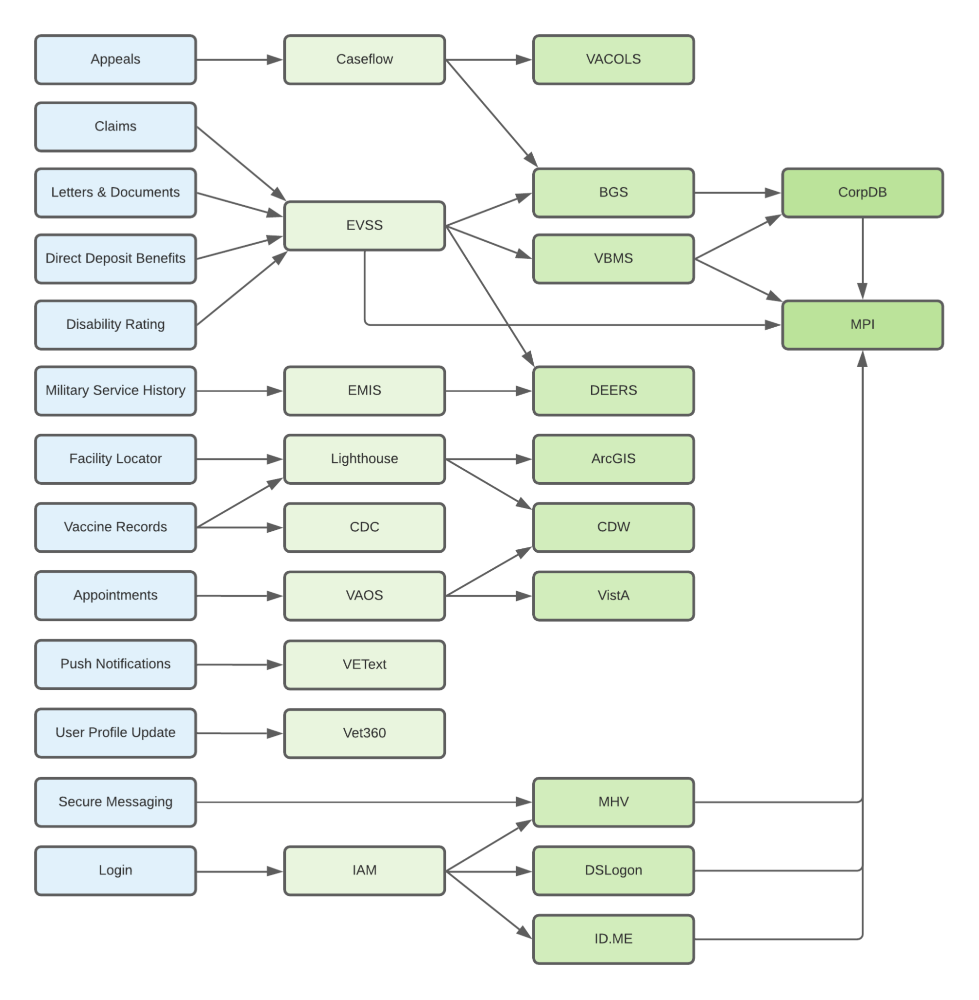

# Services

## Upstream Service Map

## Service Contacts
| Service | Slack Channel | Contacts |
| ----------- | ----------- | ----------- |
| Caseflow | [#caseflow-support-team](https://dsva.slack.com/archives/C0200QGKPKR) | |
| CDC | N/A | iisinfo@cdc.gov |
| Check-in | [#check-in-experience](https://dsva.slack.com/archives/C022AC2STBM)| |
| DSLogon | [#vsp-identity](https://dsva.slack.com/archives/CSFV4QTKN) | |
| EVSS | [#evss-prod](https://dsva.slack.com/archives/C8R3JS8BU) | |
| ID.ME | [#vsp-identity](https://dsva.slack.com/archives/CSFV4QTKN) | |
| Lighthouse | [#lighthouse-infrastructure](https://dsva.slack.com/archives/C013VCQKSE7) | |
| MHV | [#mhv-secure-messaging](https://dsva.slack.com/archives/C03ECSBGSKX), [#mhv-medical-records](https://dsva.slack.com/archives/C03Q2UQL1AS), [#vsp-identity](https://dsva.slack.com/archives/CSFV4QTKN) | |
| SIS | [#vsp-identity](https://dsva.slack.com/archives/CSFV4QTKN) | |
| VAOS | [appointments-team](https://dsva.slack.com/archives/CMNQT72LX), [#vaos-engineering](https://dsva.slack.com/archives/C023EFZPX4K) | |
| VA Profile | [va-profile](https://dsva.slack.com/archives/C7TE0PFTL)| |
| VEText | [#va-mobile-app-push-notifications](https://dsva.slack.com/archives/C01CSM3EZGT) | |
