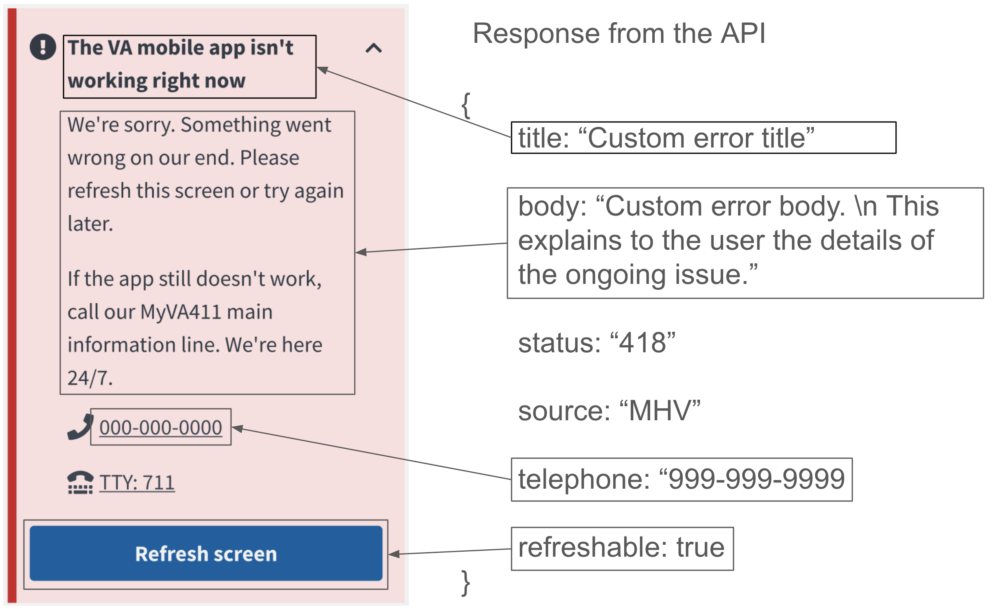

## How it works

When emergency custom error content is needed the backend will create a feature flag on the necessary endpoints in order to return a hardcoded response to the the frontend. The frontend will use the status code to know when the error content provided in the response should be combined with the existing error component. If you want to use this feature reach out to the Mobile API team in #va-mobile-app in Ad Hoc or OCTO slack.

Characteristics of the response:

- `title`: custom string provided by content to fill the bold title portion of the frontend error component
- `body`: custom string provided by content to fill the body of the error component. The frontend is prepared to respect `\\n` for new lines in this string, as well as apostrophes.
- `status`: will always be 418
- `source`: upstream system associated with the endpoint
- `telephone`: sting providing a custom phone number 
- `refreshable`: boolean telling the frontend to show or hide the refresh button
