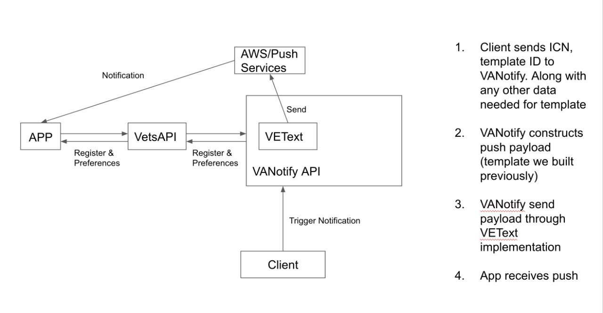

# Push Notifications

## Architectural Overview



## Getting Your Push In The App

1. Contact VANotify and VEText to get onboarded to their API and get a push template created. Reach out in slack: [#va-notify-public](https://dsva.slack.com/archives/C01CSM3EZGT) or by email oitoctovanotify@va.gov
2. Get your push template content approved by mobile. Ex:
```
{
	"default": "Appointment Reminder Default",
	"APNS": {"aps":{"alert": {"title":"VA Appointment Reminder","body":"You have an upcoming VA appointment."}},"appt":"%APPOINTMENT%"},
    "APNS_SANDBOX": {"aps":{"alert": {"title":"VA Appointment Reminder","body":"You have an upcoming VA appointment."}},"appt":"%APPOINTMENT%"},
	"GCM": {"notification": {"title": "VA Appointment Reminder","body":"You have an upcoming VA appointment."},"data": {"appt": "%APPOINTMENT%"}}
}

Note: The "data" field should include any variable data for the alert title or body, and the necessary metadata from the app to deeplink to the correct location. 
```

3. Connect your system to VANotify API to trigger push and test pre-app triggering in staging. [General VANotify Docs](https://notifications.va.gov/)
4. Get access to testflight app from mobile team to test notifications and notification preferences in staging. [Testflight & App Tester](../../../QA/Resources.md#testflight--apptester)
5. Do a Prod test if possible
6. Mobile will update store info to acknowledge new notifications if necessary
7. Go live

