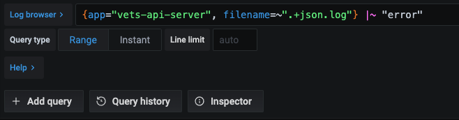
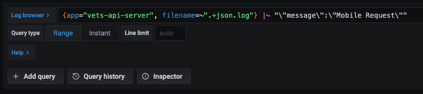

# Logs

This section goes over the process of how to access, search, and parse logs on Grafana

## How to Access and Search Logs

The Grafana UI is used as the visualization interface for logs aggregated by Loki.

To view logs, Log in to the [VFS Grafana instance](http://grafana.vfs.va.gov/?orgId=1) 🧦 ([Socks](../Testing/Prerequisites.md)
 needed; use GitHub account for auth; see image below)


Go to Explore (the little compass icon on the left-hand navigation; see image below)


Select the Loki environment that you're interested in (from the drop-down near the top-left of the page; see image below)


You'll now see a query interface for searching and analyzing log files:


In the Log browser, enter a query  starting with an app label to view all logs for a given app.

Many developers will be interested in vets-api logs:
1. To use this use case as an example, click "Log browser"
2. Make sure "app" is highlighted
3. Scroll down and highlight "vets-api-server" or "vets-api-worker" depending on your need
4. Click "Show logs"


Note: The query can be updated to include two labels such as the app and specific log file.
```
{app="vets-api-server", filename=~".+json.log"}
```

After selecting the labels for the data you are looking for, modify the query in the browser to include the text or the regex of the data you are looking for and then run the query. 

A basic query example that searches for errors within the logs:
```
{ app=~"vets-api-server", filename=~".+json.log" } |~ "error"`
```



If searching for data that has a specific key and value, the data can be searched using regex. In the example below, The query is looking for log lines that contain a key of "message" with a value of "Mobile Request".



##  How to Parse Logs

LogQL can be used to parse data out of certain log formats such as JSON or traditional Apache log formats. To parse logs, you need to enter a query of the data that you are looking for, then include the regex expression to remove the prefixed timestamp, container name, and pipe symbol. Once you use regex to extract the JSON blob to an object, you can then parse it with the built-in JSON parser.

The regex expression that needs to be included in the to extract JSON to an object is:
```
| regexp "(?P<time>\\d\\d:\\d\\d:\\d\\d) (?P<process_name>\\w+.\\d) \\s+ (\\|) (?P<json>.+)"
```

To parse JSON blob, also include in the query:
```
| line_format "{{.json}}" | json
```

The query end-result will look like:
```
{app="vets-api-server", filename=~".+json.log"} |~ "error" | regexp "(?P<time>\\d\\d:\\d\\d:\\d\\d) (?P<process_name>\\w+.\\d) \\s+ (\\|) (?P<json>.+)" | line_format "{{.json}}" | json
```

Where "error" can be replaced with any data that you are searching for within the logs.


In the resulting logs, click on one of the logs to see additional details, including extracted fields and other labels that are tagged onto that specific message. Within the list of labels will be the json label that contains the json blob.

The contents of the json are then listed under "detected fields".


