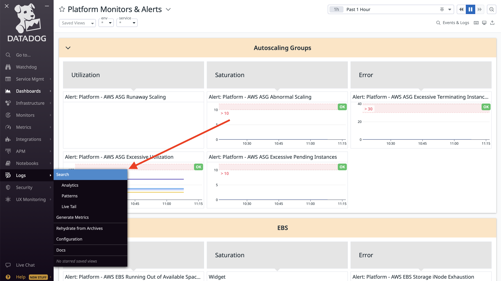

# Logs

This section goes over the process of how to access, search, and parse logs on Datadog

## How to Access and Search Logs

Locate the [Logs section](https://vagov.ddog-gov.com/logs?query=&cols=host%2Cservice&index=%2A&messageDisplay=inline&stream_sort=desc&viz=stream&from_ts=1684258977199&to_ts=1684259877199&live=true) in the menu on the left, and select search. From this screen, you should be able to find all logs that you may need. 


A few things to keep note of:
- At the top, DataDog defaults to searching for logs in the past 15 minutes. This may not be a wide enough window for you to find what you want 
- The "Search for" section does not allow you to search something as simple as `mobile` to find all mobile endpoints. It is best to select the `facets` you'd like from the menu on the left 
- When selecting options from the fields on the left, clicking the check box *unchecks* that options, clicking the text of the option itself *only* selects that option
- You can customize the table columns for the results. Clicking the dropdown arrow next to a column header will show options to replace the column, or insert one to the left or right. Depending on the type of search, it may be helpful to add a column that for `@http.url_details.path` 
- You will most likely want to select `vets-api` under the source option
- The options on the left are populated by options DataDog found in the current timeframe. So, if you're looking for logs on an endpoint that is not used often, you may not find it in the options on the left until you change the time frame you're searching for in the top right corner


## Example

Let's say we wanted to check for any errors in the past week for the endpoint `/mobile/v1/user`

1. In the time select at the top right, change 15 Minutes to Past 7 days
2. In the `URL Path` section, search for `/mobile/v1/user` and click on the word itself so that all other options are unchecked 
3. Click on any specific logs you want to view

There are a lot of options for visualizations that you can play around with that may be helpful to your unique searching.

### Worker Logs

If you wanted to search for worker logs, you can paste the following in the `Search for` field:

```
@application:vets-api-worker @named_tags.class:*ClassNameOfLogger* @message_content:Mobile*
```

# Links
- [Lighthouse Upstream Dependencies](https://github.com/department-of-veterans-affairs/leeroy-jenkles/wiki/API-Backend-Systems#api-to-va-backend-mapping)
