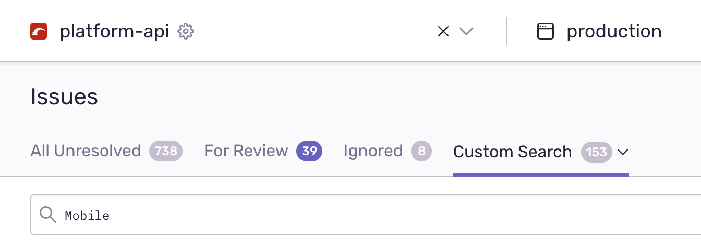
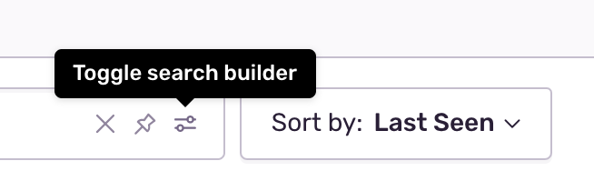
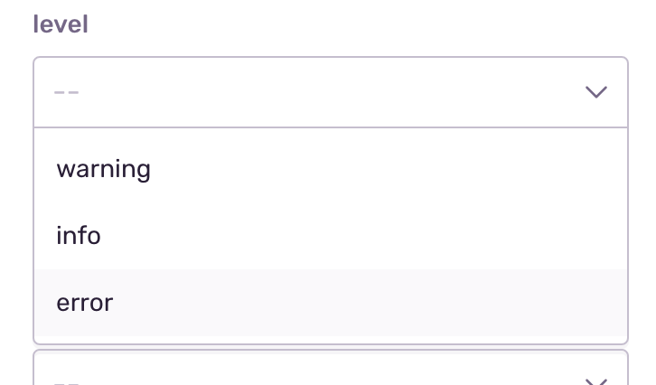
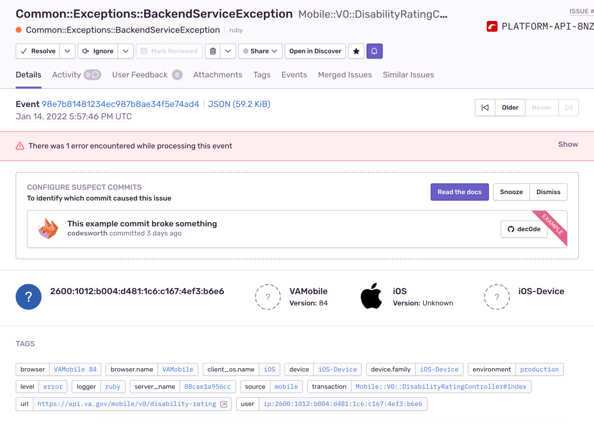
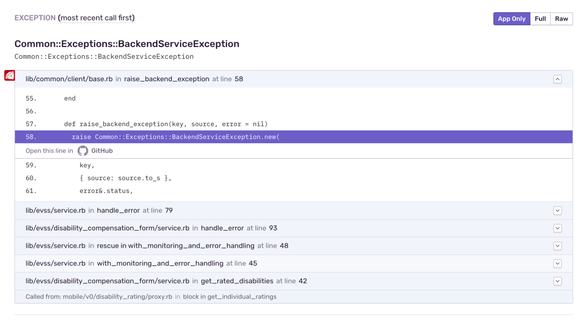
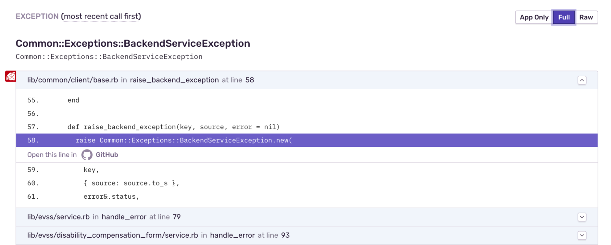
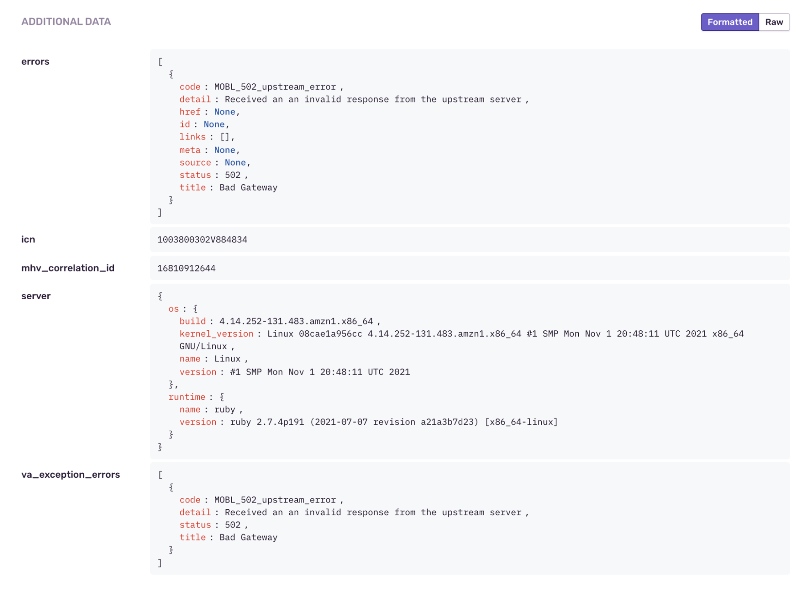

# Sentry

[Sentry](http://sentry10.vfs.va.gov/auth/login/vsp/v/auth/login/vsp/) is our automated error tracking tool. New exceptions in the API will cause Sentry to send us an email alert. We also audit the existing errors when fixing tech debt or silencing errors that are expected, i.e. unexceptional, such as when sub-systems return validation or not-found errors as 500s rather than 422s or 404s.

All our classes are namespaced with a 'Mobile' Ruby module. When auditing errors a custom search of 'Mobile' filters out other vets-api errors.

To further refine the search to only 'error', rather than 'warn' or 'info' level errors you can toggle open the search builder bar.

And then select 'error' from the list.

Once you've found an error, or have been linked to one directly from an alert email, you'll be taken to the error details page.

The majority of our errors occur during HTTP responses. Often the errors first present themselves deep within the API framework's base classes.

Selecting the 'Full' tab reveals the full call stack and as seen below the true source of the error.

Once the location of the error has been determined the next step is determining the cause. Errors from bugs we have introduced (500s in our API responses) will have clear Ruby errors such as 'NoMethodError'. For errors from sub-systems you'll need to check the 'ADDITIONAL DATA' section of the error details page.

As seen below this section includes the errors from the upstream service as well as any custom tags added for that specific service. In this case 'ICN' and 'MHV Correlation ID' can be used to cross-reference Loki based logs to get an idea of the full request flow and any user actions that lead up to the error.

