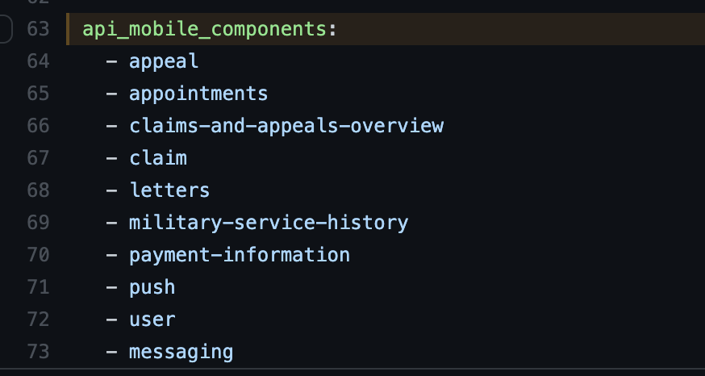

# Statsd Metrics

You can create custom Mobile metrics within Vets API by adding new statsd entries to `modules/mobile/config/initializers/statsd.rb`.

More information about Statsd can be found at: https://github.com/Shopify/statsd-instrument . In order for metics to be picked up an entry for the associated endpoint must also be in `ansible/deployment/config/revproxy-vagov/vars/nginx_components.yml` in the [DevOps repo](https://github.com/department-of-veterans-affairs/devops)

