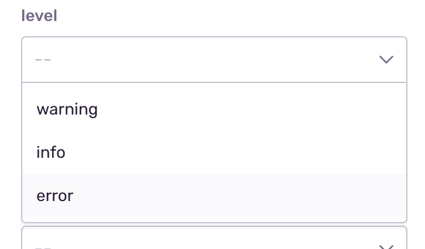
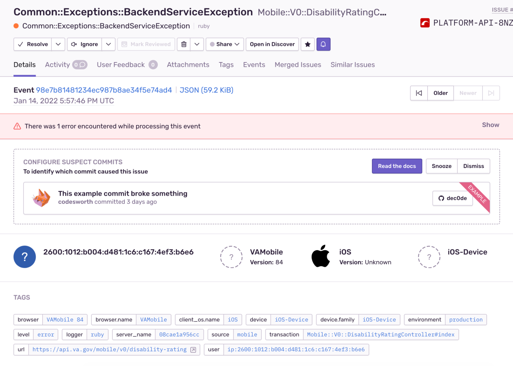
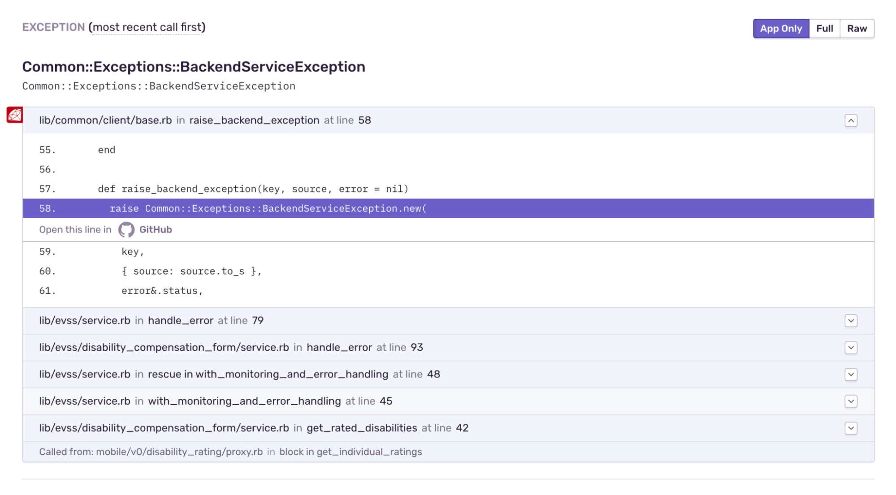
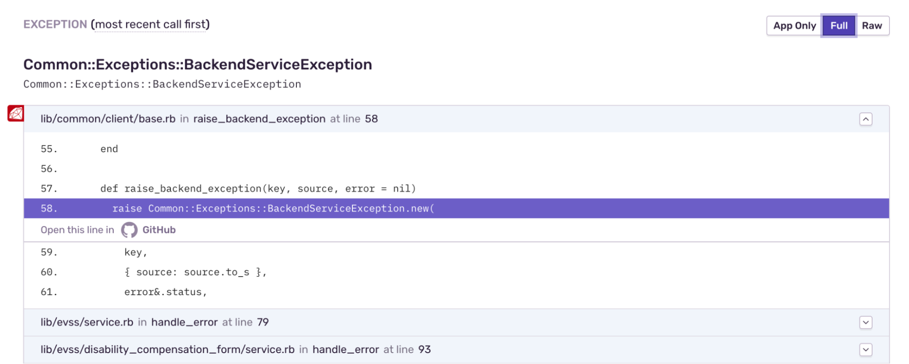
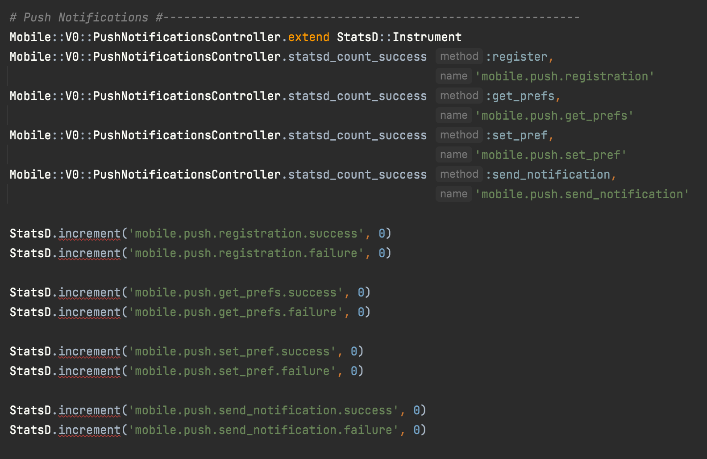
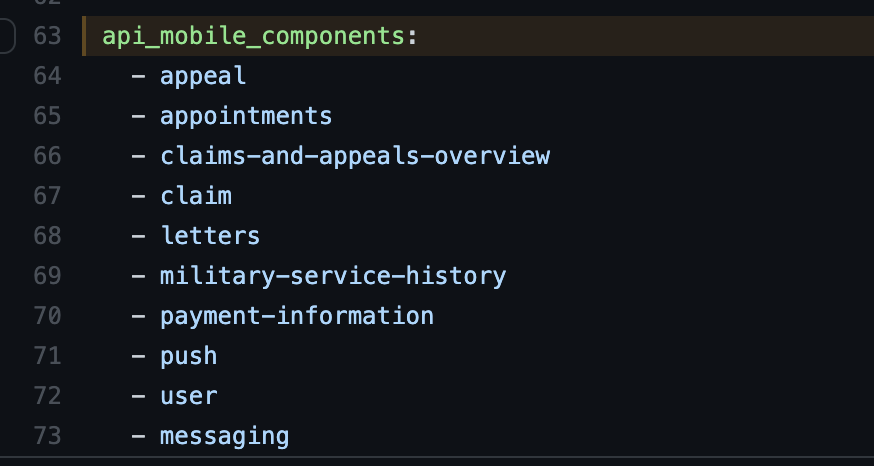

# Monitoring

Many of the investigation tools below need the [SOCKS proxy](https://depo-platform-documentation.scrollhelp.site/getting-started/Internal-tools-access-via-SOCKS-proxy.1821081710.html) or the requisite [AWS permissions](https://github.com/department-of-veterans-affairs/devops#setup) setup.

## Sentry
[Sentry](http://sentry10.vfs.va.gov/auth/login/vsp/v/auth/login/vsp/) is our automated error tracking tool. New exceptions in the API will cause Sentry to send us an email alert. We also audit the existing errors when fixing tech debt or silencing errors that are expected, i.e. unexceptional, such as when sub-systems return validation or not-found errors as 500s rather than 422s or 404s.

All our classes are namespaced with a 'Mobile' Ruby module. When auditing errors a custom search of 'Mobile' filters out other vets-api errors.


To further refine the search to only 'error', rather than 'warn' or 'info' level errors you can toggle open the search builder bar.


And then select 'error' from the list.



Once you've found an error, or have been linked to one directly from an alert email, you'll be taken to the error details page.



The majority of our errors occur during HTTP responses. Often the errors first present themselves deep within the API framework's base classes.



Selecting the 'Full' tab reveals the full call stack and as seen below the true source of the error.



Once the location of the error has been determined the next step is determining the cause. Errors from bugs we have introduced (500s in our API responses) will have clear Ruby errors such as 'NoMethodError'. For errors from sub-systems you'll need to check the 'ADDITIONAL DATA' section of the error details page.

As seen below this section includes the errors from the upstream service as well as any custom tags added for that specific service. In this case 'ICN' and 'MHV Correlation ID' can be used to cross-reference Loki based logs to get an idea of the full request flow and any user actions that lead up to the error.


## Logs

This section goes over the process of how to access, search, and parse logs on Grafana

### How to Access and Search Logs

The Grafana UI is used as the visualization interface for logs aggregated by Loki.

To view logs, Log in to the [VFS Grafana instance](http://grafana.vfs.va.gov/?orgId=1) 🧦 (SOCKS needed; use GitHub account for auth; see image below)


Go to Explore (the little compass icon on the left-hand navigation; see image below)


Select the Loki environment that you’re interested in (from the drop-down near the top-left of the page; see image below)


You’ll now see a query interface for searching and analyzing log files:


In the Log browser, enter a query  starting with an app label to view all logs for a given app.

Many developers will be interested in vets-api logs:
  a. To use this use case as an example, click “Log browser”
  b. Make sure “app” is highlighted
  c. Scroll down and highlight “vets-api-server” or “vets-api-worker” depending on your need
  d. Click “Show logs”


Note: The query can be updated to include two labels such as the app and specific log file.
```
{app="vets-api-server", filename=~".+json.log"}
```

After selecting the labels for the data you are looking for, modify the query in the browser to include the text or the regex of the data you are looking for and then run the query. 

A basic query example that searches for errors within the logs:
```
{ app=~"vets-api-server", filename=~".+json.log" } |~ "error"`
```


If searching for data that has a specific key and value, the data can be searched using regex. In the example below, The query is looking for log lines that contain a key of “message” with a value of “Mobile Request”.

###  How to Parse Logs

LogQL can be used to parse data out of certain log formats such as JSON or traditional Apache log formats. To parse logs, you need to enter a query of the data that you are looking for, then include the regex expression to remove the prefixed timestamp, container name, and pipe symbol. Once you use regex to extract the JSON blob to an object, you can then parse it with the built-in JSON parser.

The regex expression that needs to be included in the to extract JSON to an object is:
```
| regexp "(?P<time>\\d\\d:\\d\\d:\\d\\d) (?P<process_name>\\w+.\\d) \\s+ (\\|) (?P<json>.+)"
```

To parse JSON blob, also include in the query:
```
| line_format "{{.json}}" | json
```

The query end-result will look like:
```
{app="vets-api-server", filename=~".+json.log"} |~ "error" | regexp "(?P<time>\\d\\d:\\d\\d:\\d\\d) (?P<process_name>\\w+.\\d) \\s+ (\\|) (?P<json>.+)" | line_format "{{.json}}" | json
```

Where “error” can be replaced with any data that you are searching for within the logs.


In the resulting logs, click on one of the logs to see additional details, including extracted fields and other labels that are tagged onto that specific message. Within the list of labels will be the json label that contains the json blob.

The contents of the json are then listed under “detected fields”.


## Statsd Metrics

You can create custom Mobile metrics within Vets API by adding new statsd entries to `modules/mobile/config/initializers/statsd.rb`.



More information about Statsd can be found at: https://github.com/Shopify/statsd-instrument . In order for metics to be picked up an entry for the associated endpoint must also be in `ansible/deployment/config/revproxy-vagov/vars/nginx_components.yml` in the [DevOps repo](https://github.com/department-of-veterans-affairs/devops)



## Datadog

This section will share a short overview of how to use Datadog to analyze, and alert on VA metrics

### Integrations

One of the major Pros of Datadog is a plethora of already created integration steps.[Datadog integration documentation](https://docs.datadoghq.com/getting_started/integrations/)


### Exploring Metrics

You can search for existing metrics using Datadog’s explore page. Within Datadog navigate to Metrics -> Explore from the sidebar. Selecting a metric from here will automatically create a graph that can be modified and exported to new or existing dashboards. [Explore documentation](https://docs.datadoghq.com/metrics/explorer/)


### Creating Graphs

1. Navigate to Dashboards -> Quick Graphs or edit a graph from an existing dashboard
2. Choose the metric to graph by searching or selecting it from the dropdown next to ‘Metric’


3. Select filters for the metric


4. Decide how to aggregate the metric (Max, Min, Avg, Sum)


5. Apply functions to the metric. [Functions documentation](https://docs.datadoghq.com/dashboards/functions/)


Example: Total requests per second to any mobile endpoint averaged over 5 minutes


### Formulas

You can compare multiple metrics by using formulas.
Example: Request error rate averaged over 5 minutes


### Dashboards

Dashboards allow you to display many different widgets. Select the ‘Add widgets’ button then select the desired widget. [Widgets documentation](https://docs.datadoghq.com/dashboards/widgets/)


Additionally you can add variables for use across all widgets within a single dashboard. At the top of a dashboard select the pencil icon then fill in the details of your variable. These variables can be accessed from within a widget using `$[variable name]`. [Template variables documentation](https://docs.datadoghq.com/dashboards/template_variables/)


### Creating Alerts

1. Define a metric to alert on. This works the same as discussed in the graphs section above

2. Define alert thresholds. These will dictate when the alert triggers

3. Decide how you would like to be notified when the alert triggers

4. Define message you want to appear when alert triggers