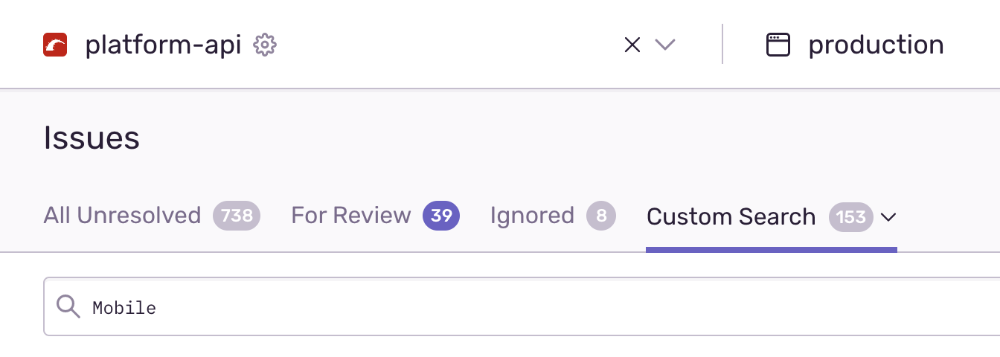

# Monitoring

Many of the investigation tools below need the [SOCKS proxy](https://depo-platform-documentation.scrollhelp.site/getting-started/Internal-tools-access-via-SOCKS-proxy.1821081710.html) or the requisite [AWS permissions](https://github.com/department-of-veterans-affairs/devops#setup) setup.

## Sentry
[Sentry](http://sentry10.vfs.va.gov/auth/login/vsp/v/auth/login/vsp/) is our automated error tracking tool. New exceptions in the API will cause Sentry to send us an email alert. We also audit the existing errors when fixing tech debt or silencing errors that are expected, i.e. unexceptional, such as when sub-systems return validation or not-found errors as 500s rather than 422s or 404s.

All our classes are namespaced with a ‘Mobile’ Ruby module. When auditing errors a custom search of ‘Mobile’ filters out other vets-api errors.

To further refine the search to only ‘error’, rather than ‘warn’ or ‘info’ level errors you can toggle open the search builder bar.

And then select ‘error’ from the list.

Once you’ve found an error, or have been linked to one directly from an alert email, you’ll be taken to the error details page.

