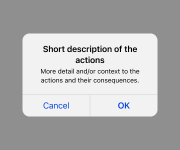

Confirmation messages are used in situations when:

1. The user chooses to do something that has serious consequences, or
2. The user takes an action in which the system needs to clarify their intent and offer a choice in how to proceed

These messages aim to reduce uncertainty around the action the user has taken or is about to take. They also prevent users from making mistakes. 

Confirmation messages include (but are not limited to) cancellation confirmation and destructive action messages. Not all actions need a confirmation message—for example, these messages are not necessary for routine actions, or when the consequences of an action are reversible or negligible. Avoid using them more than necessary in order to encourage people to pay attention to them. 

* [Confirmation Messages (Figma Design Library)](https://www.figma.com/file/QVLPB3eOunmKrgQOuOt0SU/%F0%9F%93%90-DesignLibrary2.0---VAMobile?type=design&node-id=3859%3A8455&mode=design&t=m7FtYVhqqhXCiARv-1)

#### Action sheet

In the VA: Health and Benefits mobile app, action sheets slide up from the bottom of a phone screen and appear as a popover on tablet screens (this choice is for accessibility reasons—native action sheets on iPad do not contain an explicit cancel action). 

#### Alert/dialog

The VA: Health and Benefits mobile app uses the standard native implementation for modal alert/dialogs (appearing in the center of the screen) for phone and tablet screens. 
 

 

## Usage

Use an [action sheet](https://developer.apple.com/design/human-interface-guidelines/action-sheets) (for both iOS and Android) to present the user with information related to that action when:

1. The effect of the action is minor (but not routine), and/or
2. The action is destructive (but not major), and/or
3. There’s a need to present more than 2 choices related to an intended action. 
Example: Deleting a draft, saving a draft, or going back to edit a draft 

Use an [alert](https://developer.apple.com/design/human-interface-guidelines/alerts) (for iOS) or dialogue (for Android) to present the user with critical information related to that action when:

1. The effect of the action is major (like deleting an account), and/or
2. A user has taken an uncommon action that they can’t undo

Brief messages informing users of a process that an app has performed or will perform (for example: that a message was sent successfully) can be confirmed using a [Snackbar](https://m2.material.io/components/snackbars).

### Appearance Logic for cancellation confirmations
For **fullscreen subtasks** with a Cancel button in the top left corner of the screen, we’ve established the following rules:

1. If a user is on a fullscreen subtask but **does not** input any information (such as in a form field) or does not make any **significant changes** and taps Cancel, then **do not show** a confirmation message.
2. If a user is on a fullscreen subtask and **does** input information or makes a **significant change** and taps Cancel, then **show** a confirmation message. 

_**What constitutes a “significant” change?** A significant change can include (but is not limited to) a change the user has made to the screen that may not be easily recalled by the user if removed or deleted._

1. _**Not significant:** User selects the checkbox on the “Claim evaluation” screen confirming they’ve submitted all evidence for their claim and that they’re ready to VA to make a decision on their claim._
2. _**Significant:** User selects multiple prescriptions (but maybe not all) to request refills for on the “Refill request” screen._

### Anatomy
Both action sheets and modal alert/dialogs contain the following elements:

* **Title (required):** Asks the user to confirm what action they intended to take.
* **Message (optional):** Adds more detail and/or context to the actions and their consequences.
* **Buttons (required):** At least two buttons provide the user with choices, including:
    * A **primary button** that confirms the intended action and moves the user forward. 
        * For alerts/dialogs with two actions, the primary button appears on the right. For alerts/dialogs with more than two actions, the primary button appears at the top of the button stack.
        * For action sheets, the primary button appears at the top of the button stack. It is red if destructive.
    * A **secondary button** that lets the user reconsider the action and exit the confirmation message.
        * For alerts/dialogs with two actions, the secondary button appears on the left. For alerts/dialogs with more than two actions, the primary button appears at the bottom of the button stack.
        * For action sheets, the secondary button always appears on the bottom.
    * **Additional buttons** may be included if there are additional actions a user could take related to an intended action. These appear between the primary and secondary buttons, vertically stacked. 
        * For example, when a user taps the Cancel button after starting a new message, we need them to confirm whether they want to delete this message they started (primary, destructive action), save it as a draft (additional action), or go back to editing the message (secondary, cancel action).
        * If the additional action is already a button option on the screen, there’s no need to include it in the action sheet. For example, if a user taps the Cancel button after making changes to their preferred name, we only need to ask them if they’d like to delete the changes they’ve made (destructive action) or go back to editing their preferred name (cancel action). There is no need to ask them if they’d like to save their changes (additional action) because that option is on the screen, and the user has given no indication they intended to save.

## Examples in practice

#### Action sheet

#### Alert/dialog

## Content guidelines

#### Title (required)

1. Don’t use extraneous words or phrases, like “Are you sure you want to…” or “Do you want to…”
2. Keep the title to 1 question or phrase. If you need to say more, use the supporting text section.
3. In a few edge cases, a statement or sentence works better than asking a question.
4. Add a question mark for questions. Don’t use a period for a sentence.

#### Message (optional)

1. Use this section to let users know about other consequences that will occur (that aren’t obvious from the title copy) if they take a certain action.
2. Try to word the title in a way that avoids the need for supporting text.

#### Button/s (required)

1. Keep button copy to 1 or 2 words at most.
2. Copy should answer the question that the title copy asked in a way that is clear and descriptive (avoid using “OK” or “Cancel,” as the meaning can be unclear).

## Accessibility

* Screen reader announces an action sheet as an alert as soon as the user taps the button that prompts the action sheet.
* Screen reader will announce it as Alerts as soon as the user taps onto a button that prompts the destructive action. 
* Each row, destructive or other action will be announced as a button
     ` “Title of row,” button.`
* Ensure title is designed and built-in.
* Ensure that the total number of characters is short enough for dynamic text to enlarge for those with low vision.

## Related components

[Snackbar (Figma Design Library)](https://www.figma.com/file/QVLPB3eOunmKrgQOuOt0SU/%F0%9F%93%90-DesignLibrary2.0---VAMobile?type=design&node-id=3876%3A7601&mode=design&t=vRmODrtl7vyBqC7L-1)

## Engineering resources
TBD
