# How to use GitHub Desktop and Sublime text to make pull requests

## Install git
[Git - Installing Git](https://git-scm.com/book/en/v2/Getting-Started-Installing-Git)
### On Mac
Open terminal and run `git —version` If you do not already have it installed it will prompt you to install it.

### On Windows
[Git - Downloading Package](https://git-scm.com/download/win)

## sublime text
[Sublime Text - Text Editing, Done Right](https://www.sublimetext.com/)

## Install GitHub Desktop
[GitHub Desktop | Simple collaboration from your desktop](https://desktop.github.com/)

[Getting started with GitHub Desktop - GitHub Docs](https://docs.github.com/en/desktop/installing-and-configuring-github-desktop/overview/getting-started-with-github-desktop)

Open the zip file.
When Finder comes up, you will want to drag the application into the Applications folder

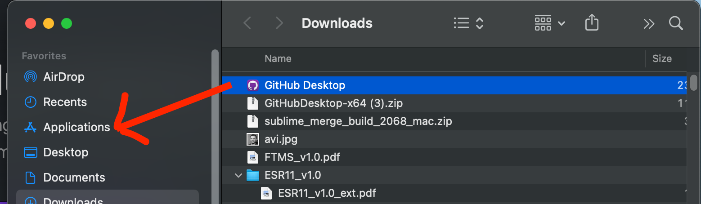

You can then open the app from either the finder window or using quick search `⌘ + Space` and type GitHub desktop

You may see a warning the first time you open the app, click Open

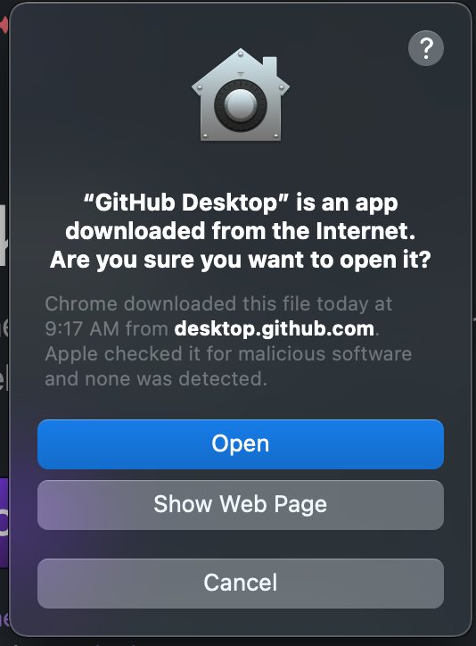

When the app opens it may ask you to log into GitHub.

Once you are logged in you should see a screen like this:

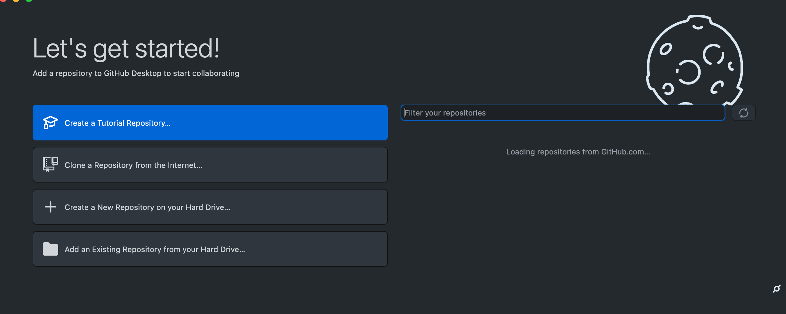

Wait until your repositories list loads on the right

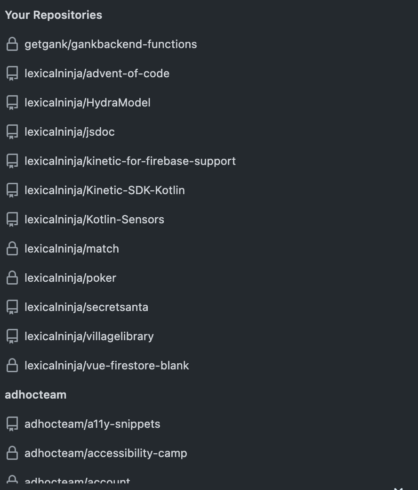

Scroll or use search until you find `department-of-veterans-affairs/va-mobile-app`

When you click on the repository name, you should get an option to clone the repository

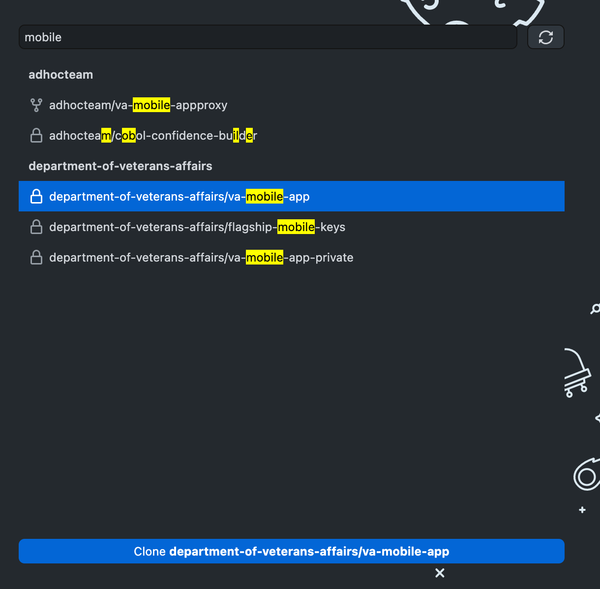

Click the clone button to pop up a modal. Choose the local path on your machine where you want to save it and click the clone button
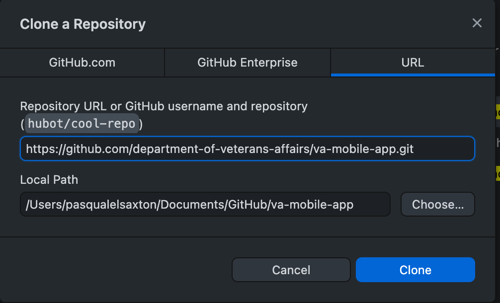

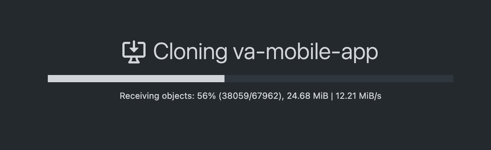

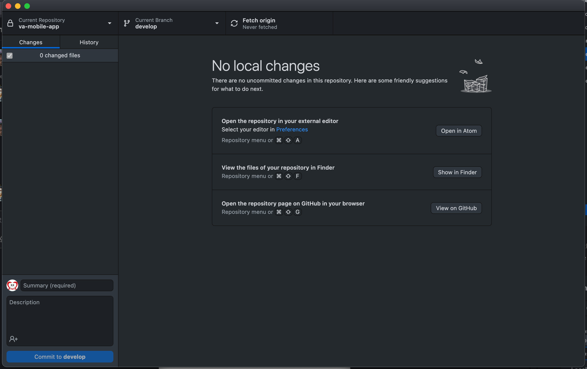

## Create a new branch
To create a branch, you first need to know what base you need. The base of the branch determines what code changes are available to your branch when you start it. If we think of develop as a truck, then the two branches shown below will have slightly different code checked in because of where they are branched from. You can see that the yellow branch will have started and be missing two gray commits that the blue branch will have because of where it was based.

This means we need to pay attention the to base branch when we make new branches.
In most cases, you will probably have two cases to choose from :
1. I am making new changes that need to get added to the app or wherever, but NOT for the release ticket. For these you will likely need to base off of the `develop` branch.
2. I am making change FOR a release ticket, such as what’s new or content changes that have to be in the next release. For these you will need to base it on the correct release branch and will need to do some extra work.

### If your new branch is based on `develop`
Click on the Current Branch tab at the top

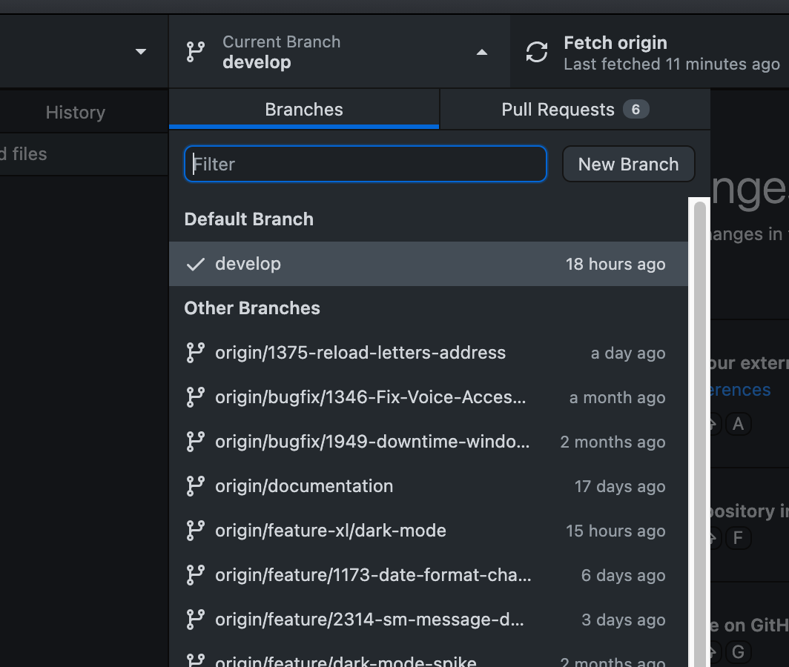

There are a few ways to create a new branch. You can type in a branch name in the search, then click the `New Branch` or the `Create New Branch` button.

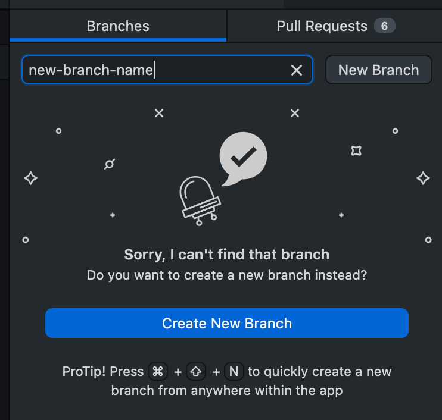

You can also press `⌘ + Shift + N` to create a new branch from anywhere in the application. You will see this modal. Just enter your branch name and click `Create Branch`

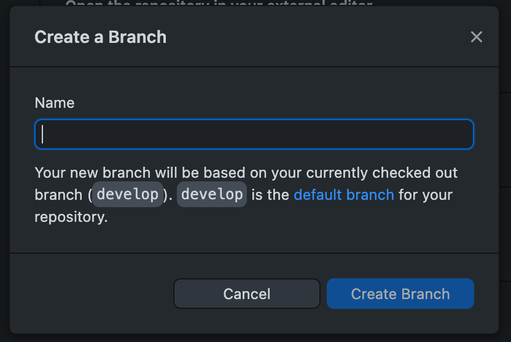

Once you have created your branch, you should see this:

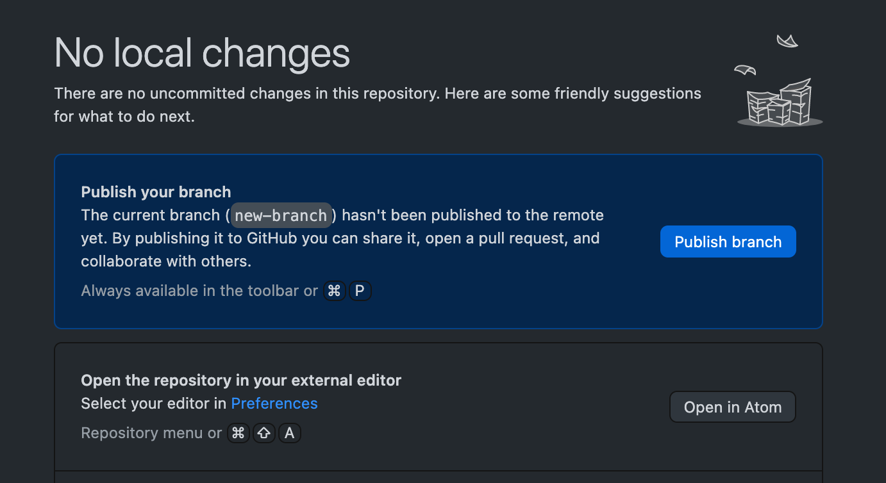

You can now start making your changes to the repository. There is no need to publish your branch at this time, we can make all of your changes first and then publish it.

### If your changes are for a release
You will need to copy the release branch from the remote repository to start. This is called pulling a remote. To do is in GH desktop, you will simple search for the branch on the server and double click it. Click on the current branch tab, type `release` into the search and double click the release branch you want to update. It should pre prefixed with `origin/` like you see below for `origin/release/v1.12.0`. Click the branch name and your GH Desktop will pull down that branch history and change to that branch for you.

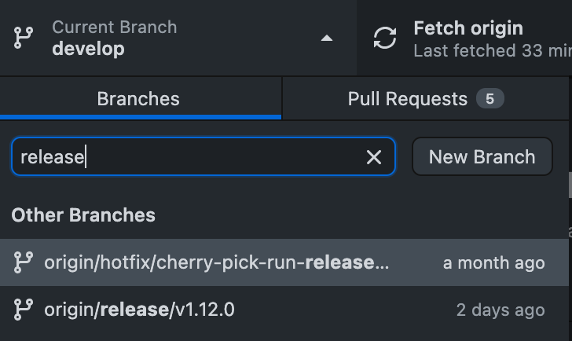

Now that we have our starting place, we can then create a branch based on `release/v1.12.0`. Create a new branch any of the ways listed above, but when the create branch modal pops up, you will need to change the base branch from develop to the correct release branch.

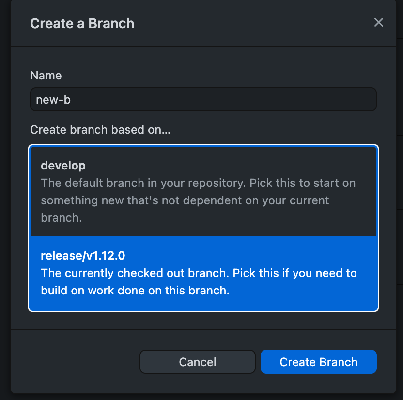

Click the `release/vx.y.x` that is the correct version and click `Create Branch`

You now have a branch that will update for only the release branch that you can now start making changes on.

## Open the repository in Sublime text
Open Sublime Text from your applications folder or using quick search `⌘ + Space`

In GitHub Desktop, click on the Current Repository tab at the top and right click on `va-mobile-app`. Select `Reveal in Finder`

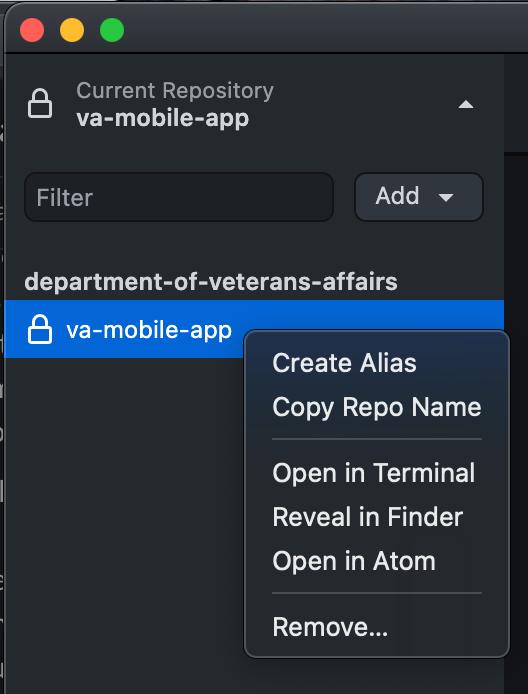

Click on the `va-mobile-app` text at the top of finder so that a folder icon pops up. Drag that icon onto the sublime text icon that should be visible in your dock area.

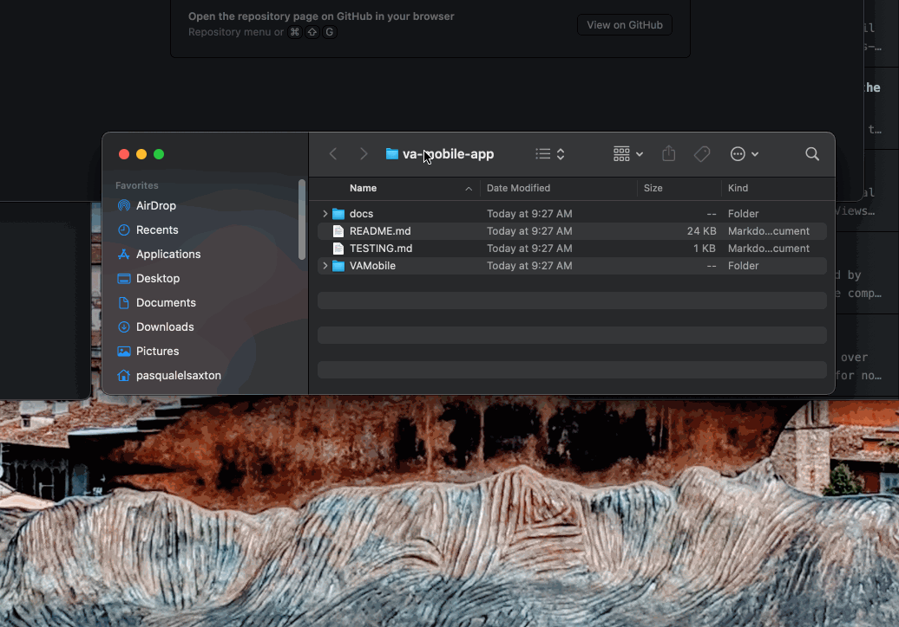

Sublime text should open a new window with your files in a sidebar on the left and a black text editor in the middle. You can now navigate the files in the repo in order to make your changes.

## Making and saving changes
Once you have made changes to the files you want to update, you will need to save the changes in sublime to make them show up in GH Desktop. You can Save All changes with `Option(⌥) + ⌘ + S`

If you now look at GH Desktop, you should see a list of changes in the left-hand tab.

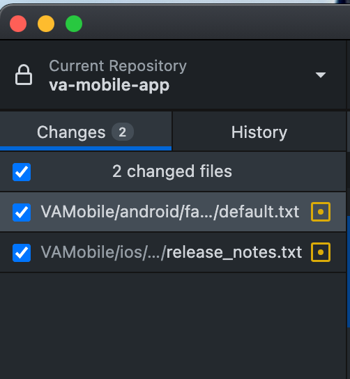

If you click on a file, you can see the set of changes for each file (called a diff). Green indicates a line was added. Red indicates the line was deleted.

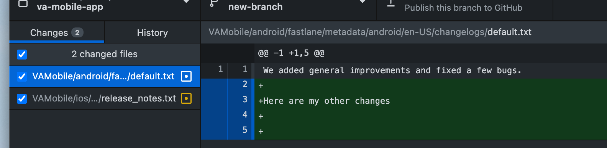
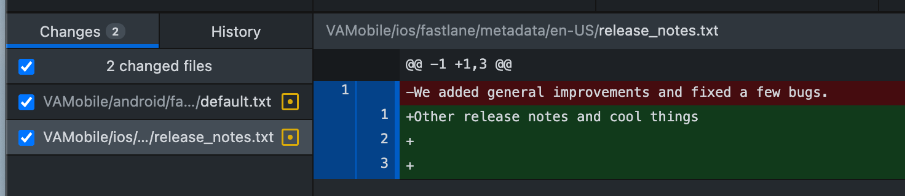

## Committing Changes
Once we have all the changes we want to make, we need to save the changes to our git history so that the repository is updated. We call this committing changes to git. To do so in GH Desktop, simple check the box to the left of each file that you want to save changes from. You can save all the changes at once or split up changes in a couple of commits if you want to add changes by some type of change grouping (i.e. all image updates in one commit, all text updates in a second). Its not necessary to do more than one commit, but if you make a lot of changes it can be helpful to break it up in case you make a mistake you need to undo(revert).

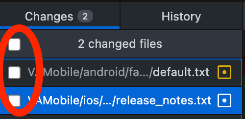

Once you have selected all the changes you want to commit, you will need to enter a summary message and commit the changes. Add a summary message that explains the changes in case someone needs to review the history and can easily tell what you were up to. In this case I am making my message “update what’s new text for iOS and android”. Click `Commit to <branch_name>` to save the changes to git.

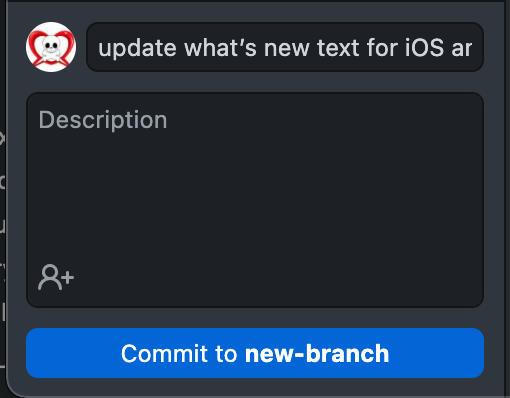

GH Desktop should then show you a screen that says No local changes again.

If you have more changes or more commits, go ahead and do those now. Once you have all the changes you want to make, you will need to publish your branch so that you can make a pull request.

## Publish your branch
In order to make a Pull Request and add your changes back onto the base branch, you will need to copy your local branch up onto the GitHub server. To do this, you just need to go to the GH Desktop app, and click either the `Publish Branch` tab at the top or the `Publish Branch` button in the Publish your branch area. The branch should get pushed up to the repository and you should then see an area to `Create Pull Request`

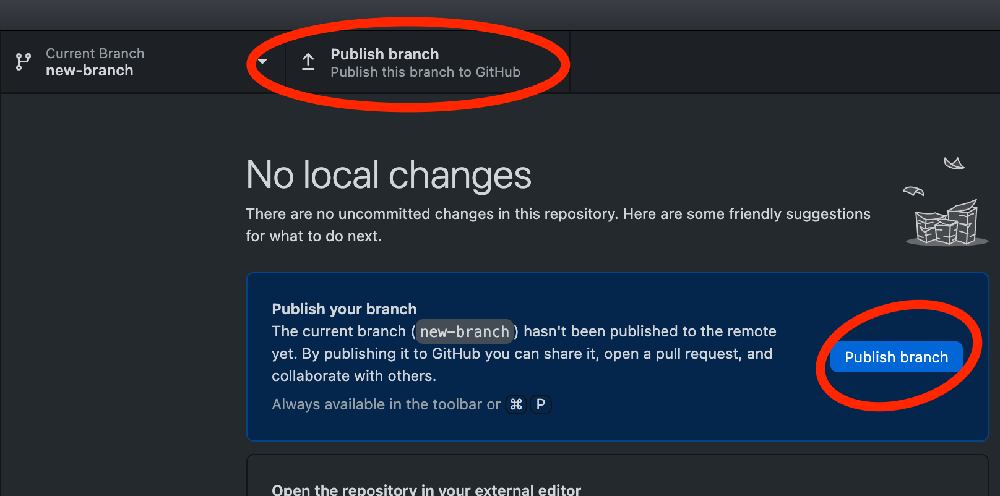

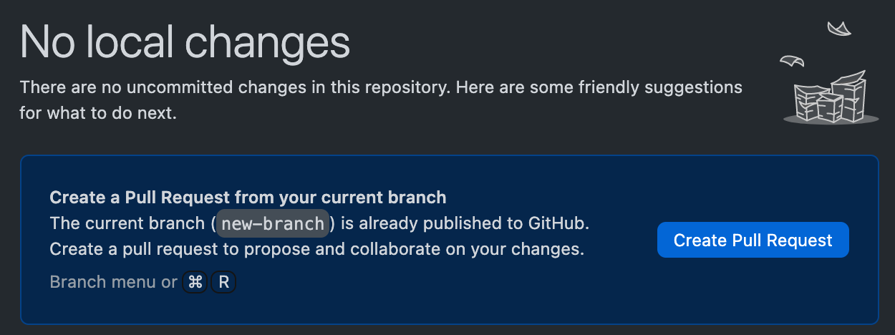

Now the only thing left to do is create a pull request so that others can review your changes before they are added to the repository.

## Create a Pull Request
Click the Create Pull Request button. This should open a browser window that takes you to a Pull Request template in the repository.

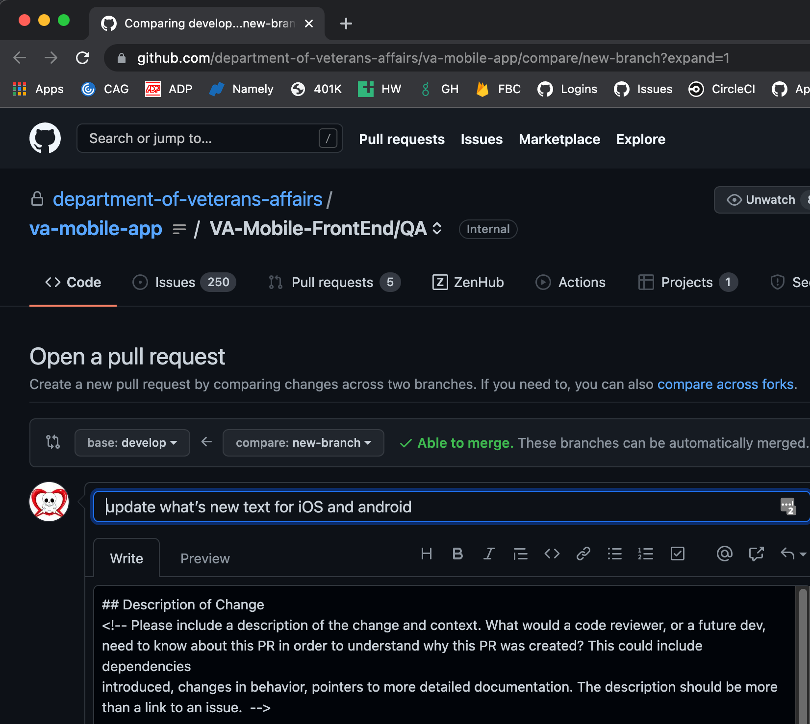

Follow the template to add changes and explain to reviewers what is being added or subtracted from the code base.

You should also connect the ticket to this PR request so that the two move through the ZenHub pipelines together. To do this, you will need the [ZenHub Browser Extension for Chrome and Firefox](https://www.zenhub.com/extension?utm_term=zenhub%20chrome%20extension&utm_campaign=Brand&utm_source=adwords&utm_medium=ppc&hsa_acc=8479887336&hsa_cam=14577630669&hsa_grp=127140912459&hsa_ad=544547662444&hsa_src=g&hsa_tgt=kwd-865948335962&hsa_kw=zenhub%20chrome%20extension&hsa_mt=e&hsa_net=adwords&hsa_ver=3&gclid=Cj0KCQiAuP-OBhDqARIsAD4XHpeArSRObIEEcSVF64ECWjuMc6zvVhYdBryYnkuwlxx1H2SghSnixR4aAlVyEALw_wcB) installed. Once this is installed, there should be a button under the text input for you to search the issues in our repo.

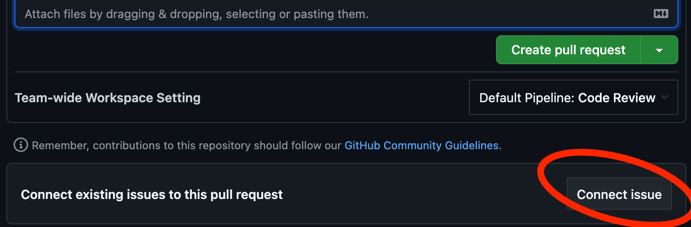

Click `Connect Issue` and search for the ticket by title or number

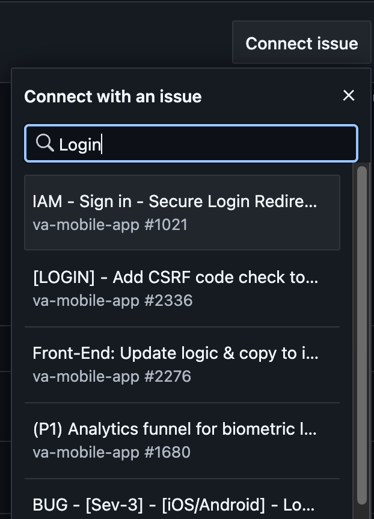
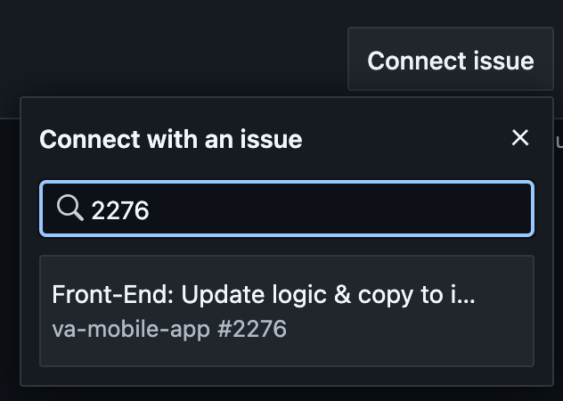
Once you have connected the issue, you should see something like this:

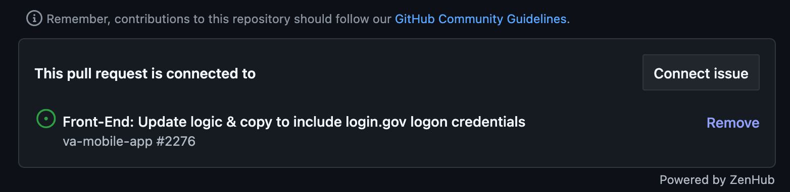

Next, you will need to add any specific reviewers you need. If you don’t know, you can leave it empty. Click the reviewers section on the right-hand side and search for folks you need to review.

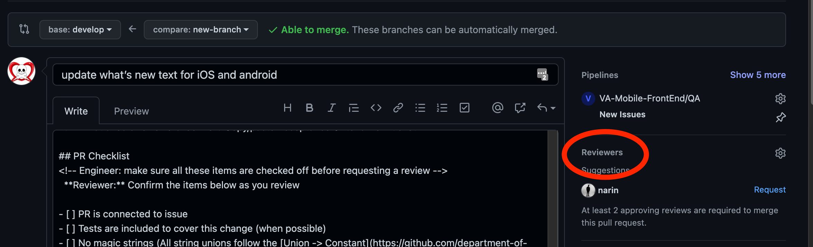
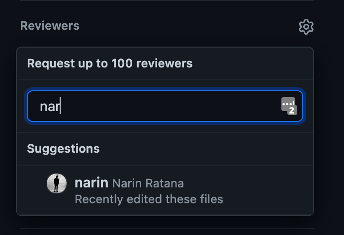

Click on the user’s name to add them as a reviewer. You should see a check next to their name if you’re successful

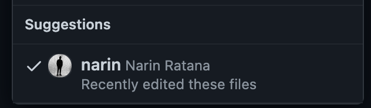

Click outside the box when you are done adding people. You should now see a list of reviewers with orange dots next to their names to indicate that they have not yet started a review

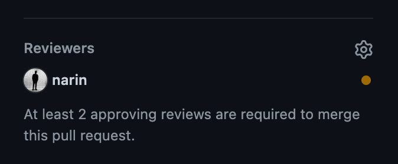

Click the green `Create pull request` button to finish your work and send the PR for review.
