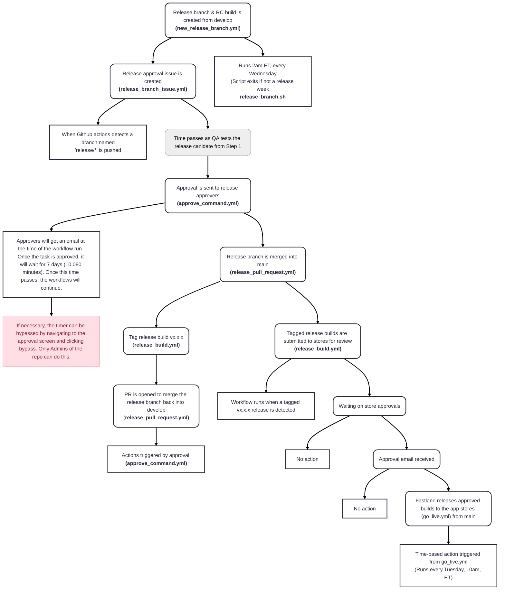

<iframe width="800" height="650" title="Flagship mobile technical release process" src="https://www.figma.com/embed?embed_host=share&url=https%3A%2F%2Fwww.figma.com%2Ffile%2FuDs0x8clV8Df6P4Ldkh2Li%2FRelease-Process%3Fnode-id%3D0%253A1%26t%3D0A6XbacxiCx1k67E-1" allowfullscreen></iframe>

