# Setting up to update the VA Mobile doc site

Before you can update the [VA Mobile documentation website](https://department-of-veterans-affairs.github.io/va-mobile-app/), you first need to download and set up a few different tools. You only need to do this once. Feel free to buddy up with someone for help with the initial setup!

### 1. Download & install Git  
Instructions: [Git - Installing Git](https://git-scm.com/book/en/v2/Getting-Started-Installing-Git)

#### On Mac:  
Open **Terminal** (It’s in Applications > Utilities; you can also use Spotlight to find it by pressing CMD + Spacebar on your keyboard and typing in the word “terminal.”

To run **Git**, type `git`  and then hit enter. If not installed, it will prompt you to install (hit “install”).

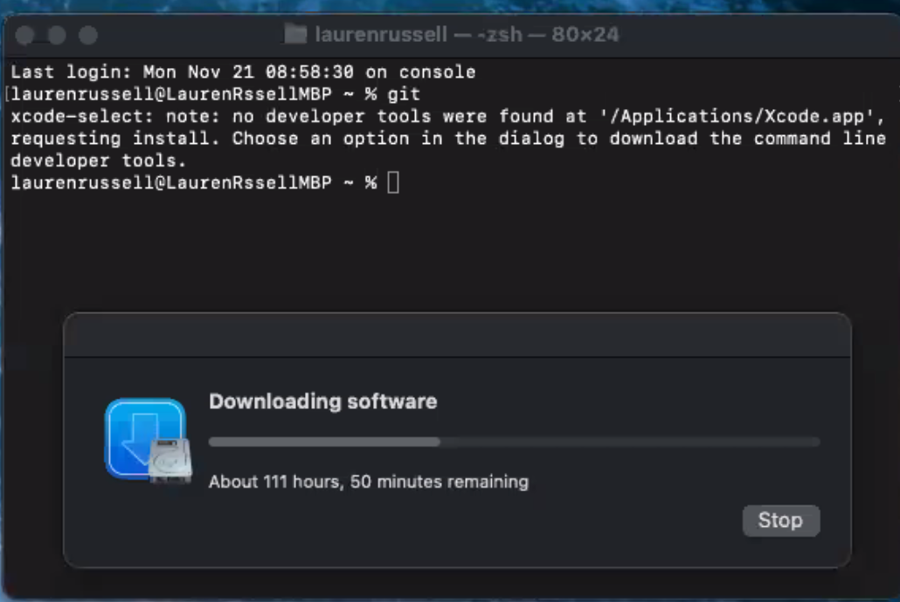

If already installed, it will look like this:  

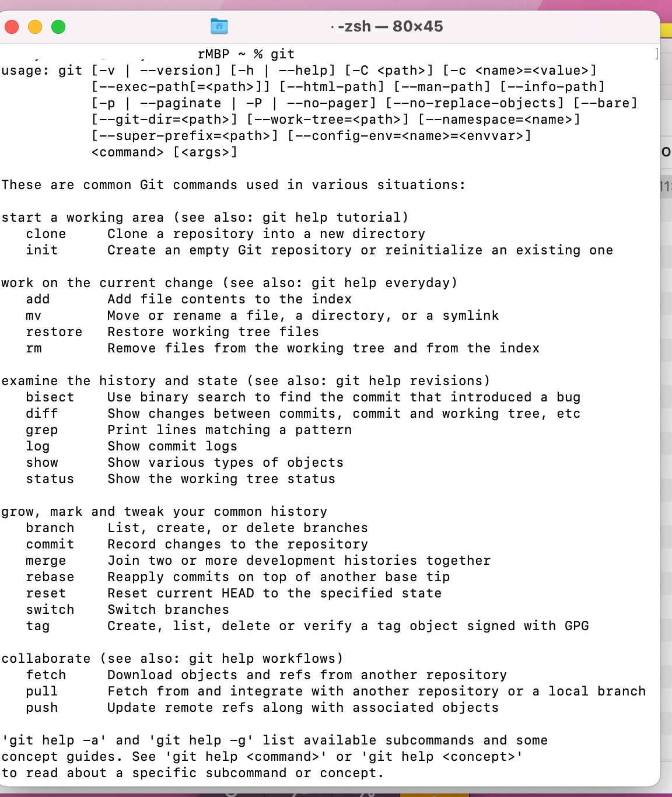

#### On Windows:  
[Git - Downloading Package](https://git-scm.com/download/win)

### 2. Download & install a text editor  
For example: [Sublime Text](https://www.sublimetext.com/) or [TextMate](https://macromates.com/)
_(You can do this while Git is downloading)._

### 3. Download & install GitHub Desktop  

#### a. Download GitHub Desktop  
_(You can also do this while Git is downloading)._

* [GitHub Desktop](https://desktop.github.com/)
* [Getting started with GitHub Desktop - GitHub Docs](https://docs.github.com/en/desktop/installing-and-configuring-github-desktop/overview/getting-started-with-github-desktop)

#### b. Install GitHub Desktop

Open the **ZIP file**. When Finder comes up, you will want to drag the application into the Applications folder. (Not running GitHub Desktop from the Application folder could cause problems with the app.)

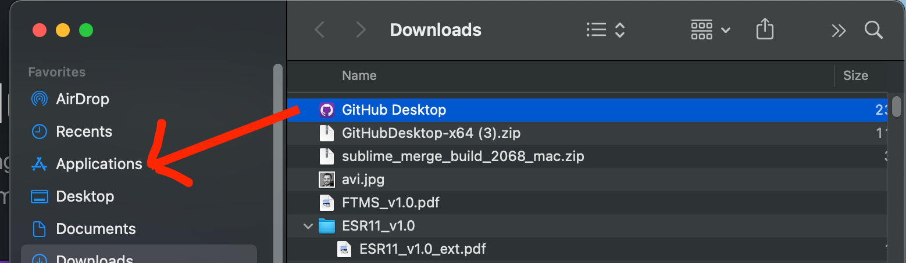

Open the **GitHub app** from either the Finder window or using quick search ⌘ + Space and type “GitHub desktop”. 

The first time you open the app, you may see a warning:

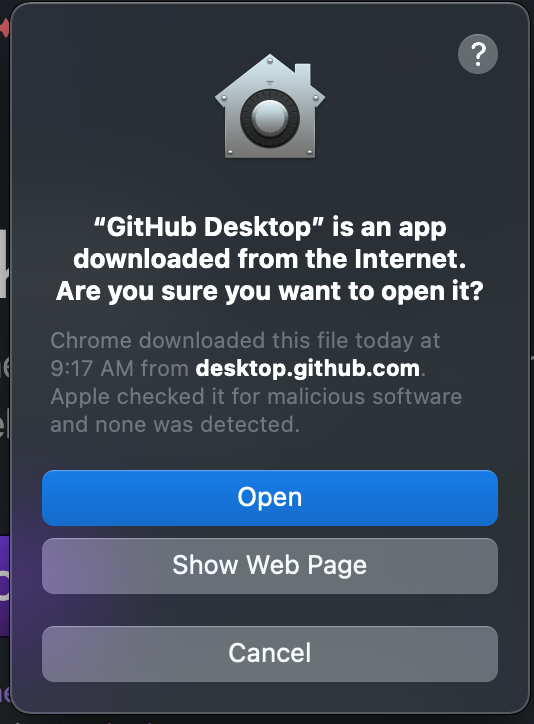
 
If so, click Open.

#### c. Set up GitHub Desktop

_(You need to have Git installed to do this step)_. When the app opens it may ask you to log into GitHub. Once you are logged in you should see a screen like this:

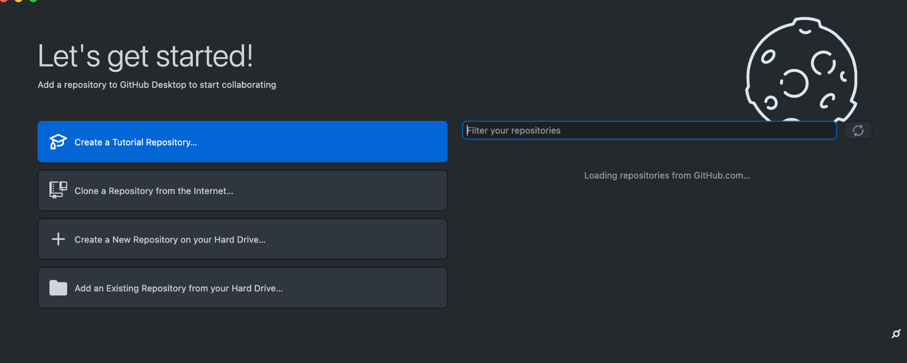

Wait until your repositories list loads on the right. 

##### Get connected to the va-mobile-app repository

Once the list has loaded, scroll or use search until you find **department-of-veterans-affairs/va-mobile-app**. Click on the respiratory name (department-of-veterans-affairs/va-mobile-app). You should get an option to clone the repository (button at the bottom): 
[https://github.com/department-of-veterans-affairs/va-mobile-app](https://github.com/department-of-veterans-affairs/va-mobile-app)

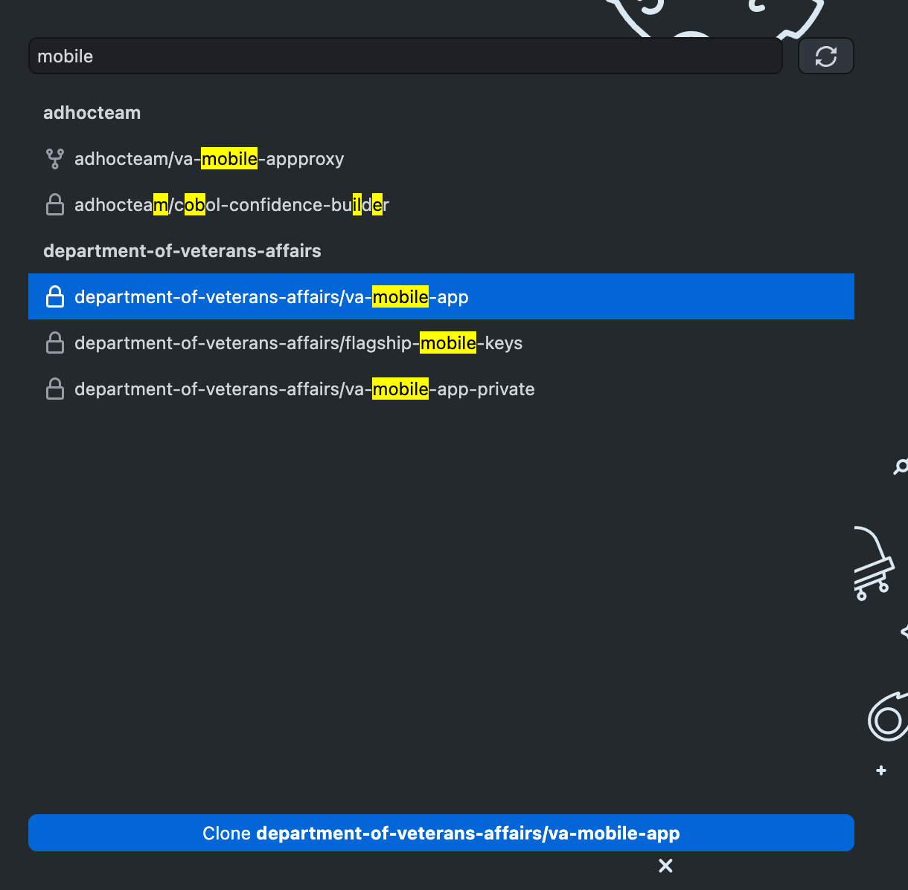

##### Cloning the va-mobile-app repository

Click the “Clone department-of-veterans-affairs/va-mobile-app” button. A modal will pop up (see below). 

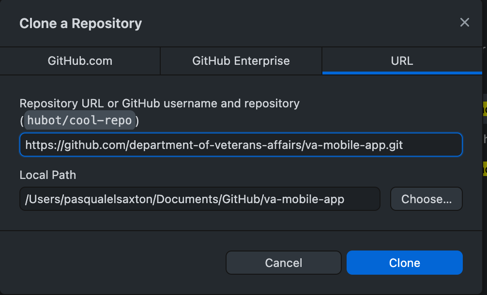

 
Choose the local path on your machine where you want to save it and click the “Clone” button (Documents is a good place, but anywhere but Desktop is a fine place to put it).

You will then see a loading screen: 

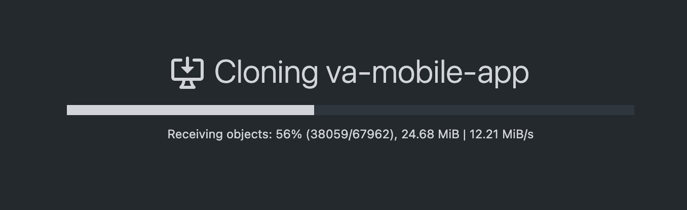

When the repository has finished cloning, your Github Desktop screen will look like this:

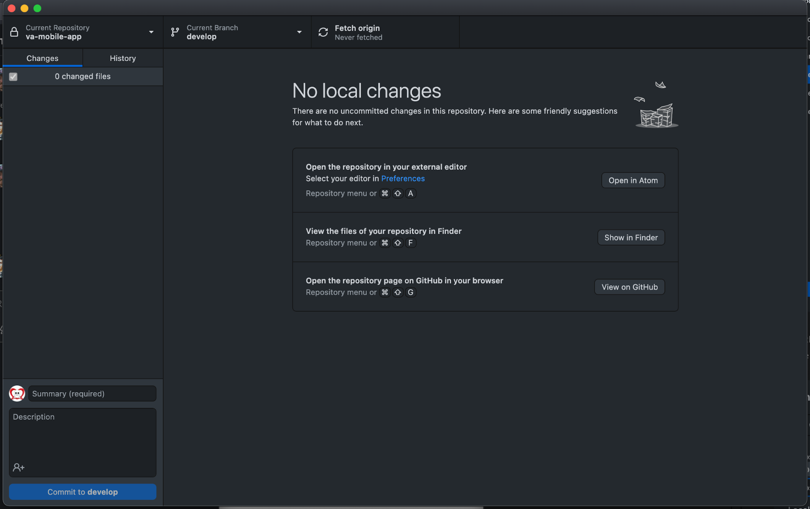

Your tools are now set up and ready for you to make changes to the Doc site!

### 4. Set up Docusaurus

The VA Mobile documentation website is built using [Docusaurus 2](https://docusaurus.io/), a modern static website generator. There are several steps you’ll need to take to get it set up. See also: [Docusaurus Installation](https://github.com/department-of-veterans-affairs/va-mobile-app/tree/develop/VAMobile/documentation).  
#### On Mac:  

1. Open **Terminal.** Download & install these things in the following order:
   1. Download & install **[home brew](https://brew.sh/)** 
   2. Download & install **[node](https://treehouse.github.io/installation-guides/mac/node-mac.html)** and **[npm](https://docs.npmjs.com/downloading-and-installing-node-js-and-npm)**
   3. Download & install **[yarn](https://classic.yarnpkg.com/lang/en/docs/install/)**

#### On Windows:

1. Open **Command Line.** Download & install these things in the following order:
    1. Download & install **[node](https://nodejs.org/en/download/)**
    2. Download & install  **[npm](https://docs.npmjs.com/downloading-and-installing-node-js-and-npm)**
    3. Download & install **[yarn](https://classic.yarnpkg.com/lang/en/docs/install/)**

To set up Docusaurus, you will need to do two things.

#### First: Open the VAMobile folder in Terminal or Command Line.   
   1. To do this, use the **Finder** to navigate to the folder where the doc site is on your machine: `somefolderonyourcomputer/VAMobile`

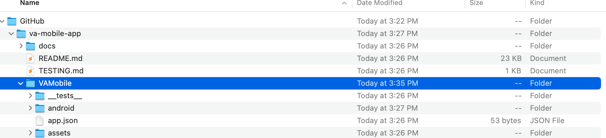

   2. Back in Terminal/Command Line, type `cd` and then a space, then drag and drop the `somefolderonyourcomuter/VAMobile/` folder from the finder into Terminal/Command Line. It will look like this:

   3. Hit enter. Type `yarn `and hit enter again.

#### Next: Navigate to the doc site repository folder in Terminal/Command Line.  
   1. To do this, use the **Finder** to navigate to the folder where the doc site is on your machine: `somefolderonyourcomputer/VAMobile/documentation`

   2. Back in Terminal/Command Line, type `cd` and then a space, then drag and drop the `somefolderonyourcomputer/VAMobile/documentation` folder from the finder into terminal. It will look like this:

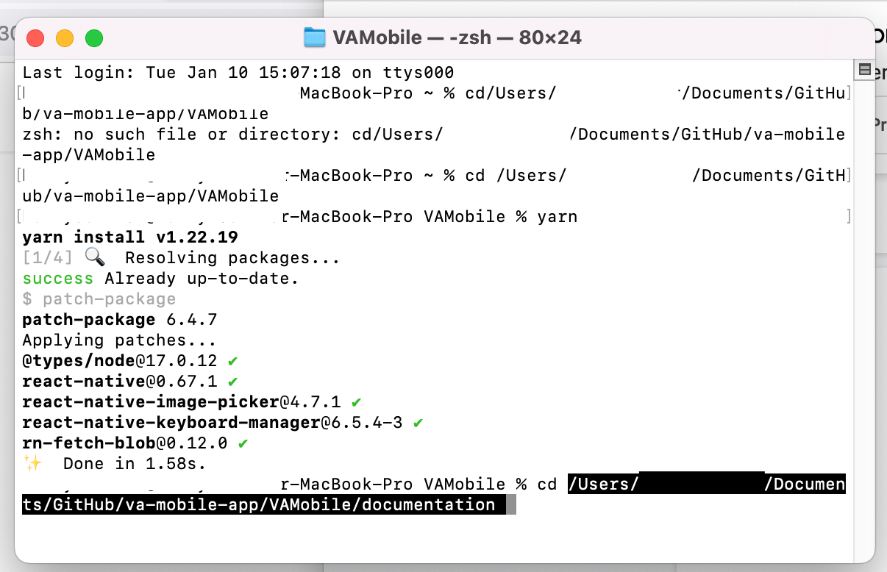

   3. Hit enter. To install Docusaurus, type `yarn` and hit enter again.  
   4. Docusaurus is now installed!  

