# How to update the VA Mobile doc site 

Follow these steps each time you want to make an update to the [VA Mobile doc site](https://department-of-veterans-affairs.github.io/va-mobile-app/).

You need:

* A folder on your computer where you’re making changes to markdown (.md) files (open in Finder)
* GitHub Desktop
* A text editor (like Sublime text)
* Terminal/Command Line
* A browser 

### 1. Get the latest version of the live doc site to work from  

To get the latest version, open** GitHub Desktop**. Make sure the current repository says “va-mobile-app” and the current branch is set to “develop.” Click “Pull/Fetch origin” to get the latest version of the site.

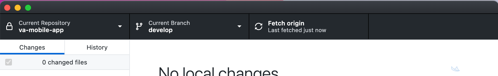

### 2. Create a new branch to edit pages & make your changes  
(Do not work directly in develop). Open the current branch menu and choose the “new branch” button option. 
 
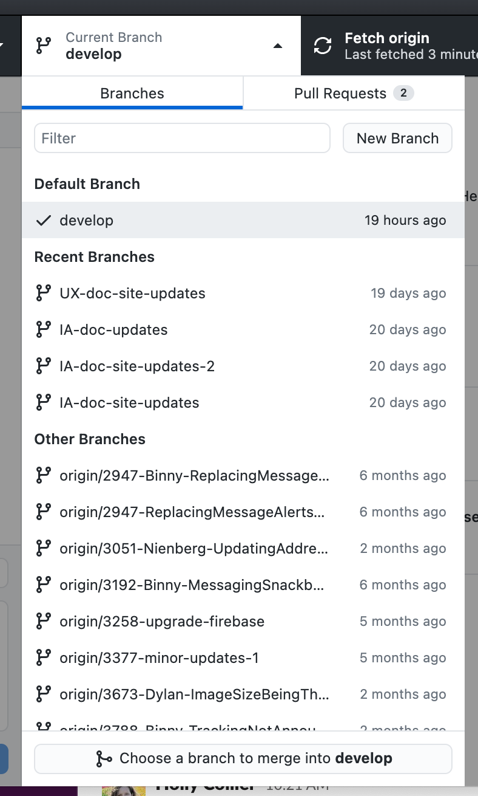

Give the new branch a unique name. Make sure it’s based on the **develop** branch & then click “Create branch”.   

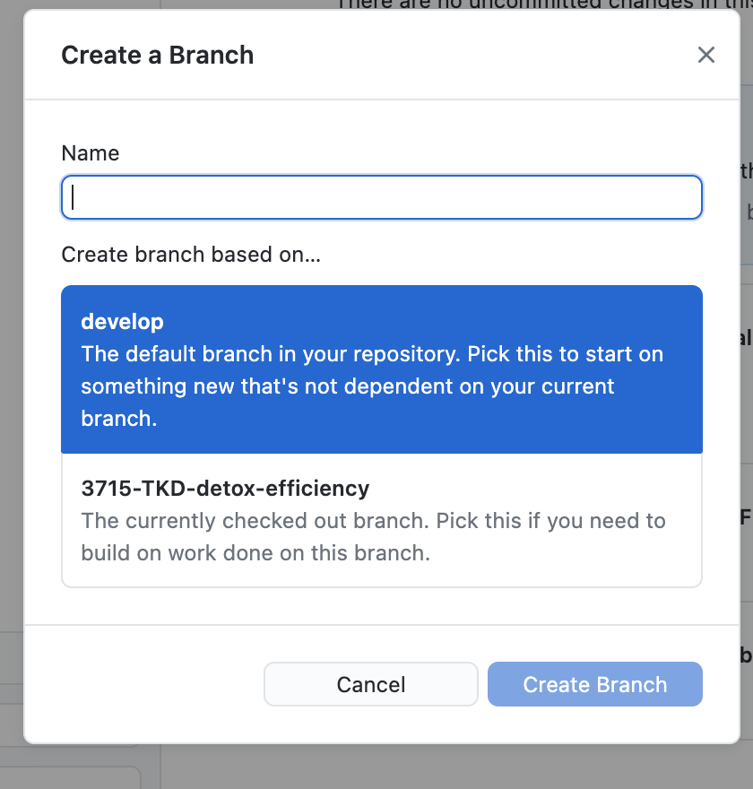

The current branch should now show the name of the branch you created: 

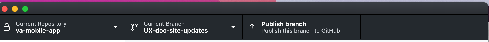

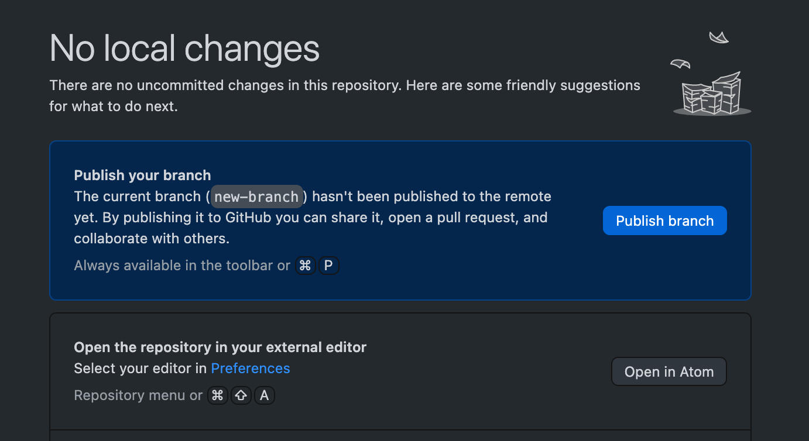

Now you have a place where you can make edits to the doc site! 

### 3. Get set up to view changes to your local copy of the doc site in a browser  
To be able to see the changes you’re going to make to md files rendered in a browser, you need to run the local version of the doc site on your computer.  

First, open **Terminal/Command Line**.

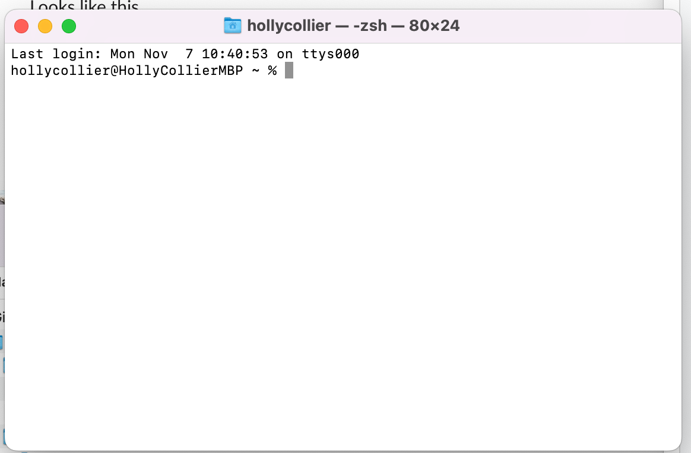

Then use the **Finder** to navigate to the folder where the doc site is on your machine: `somefolderonyourcomputer/VAMobile/documentation`  

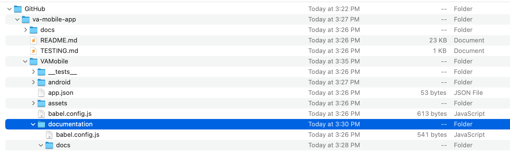

Back in Terminal/Command Line, type `cd` and then a space, then drag and drop the `somefolderonyourcomputer/VAMobile/documentation` folder from the finder into Terminal/Command Line. It will look like this:  

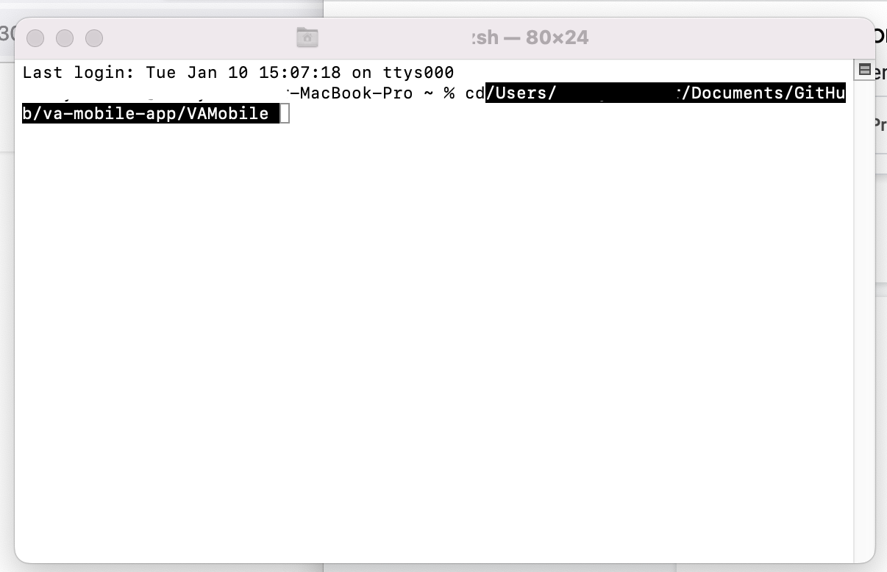

Hit enter. Then type `yarn start` and hit enter again. It will then do this:  

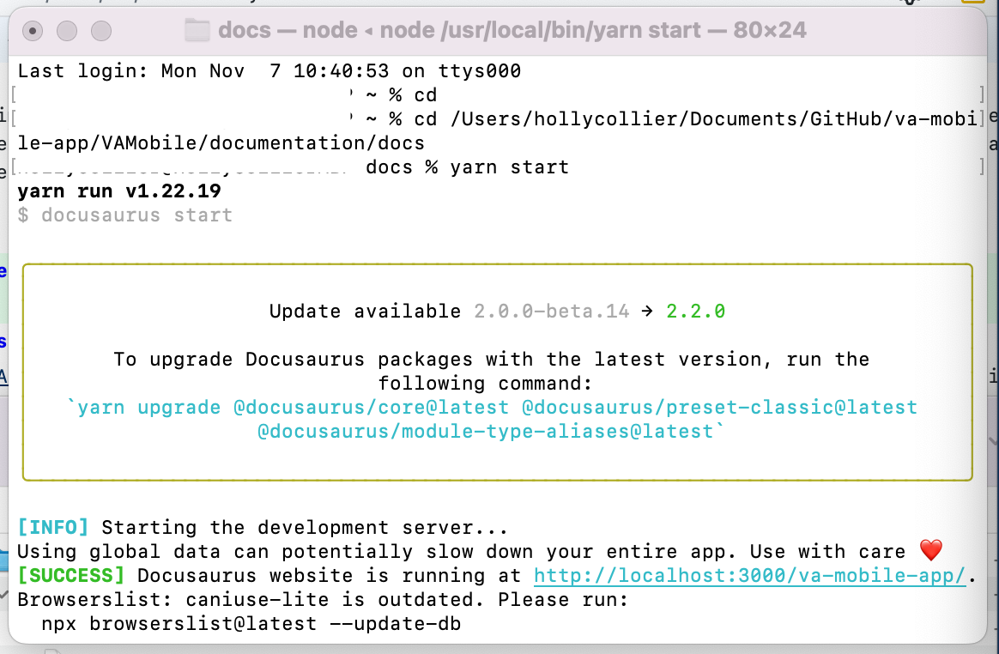

It will also automatically open a new browser window where changes to your files will be rendered (if you see an alert, give it permission to open your browser). The URL bar for that new window will look like this:  

Now you’re ready to start making edits to the doc site!

### 4. Open the repository in your text editor to edit, create new and save md pages  
* **To create a new md page:** Open the Doc site folder within your text editor and choose “New File”. The new page will open in the text editor.
* **To edit an existing md page:** Open the Doc site folder within your text editor & select the file you want to edit. The page will open in the text editor.

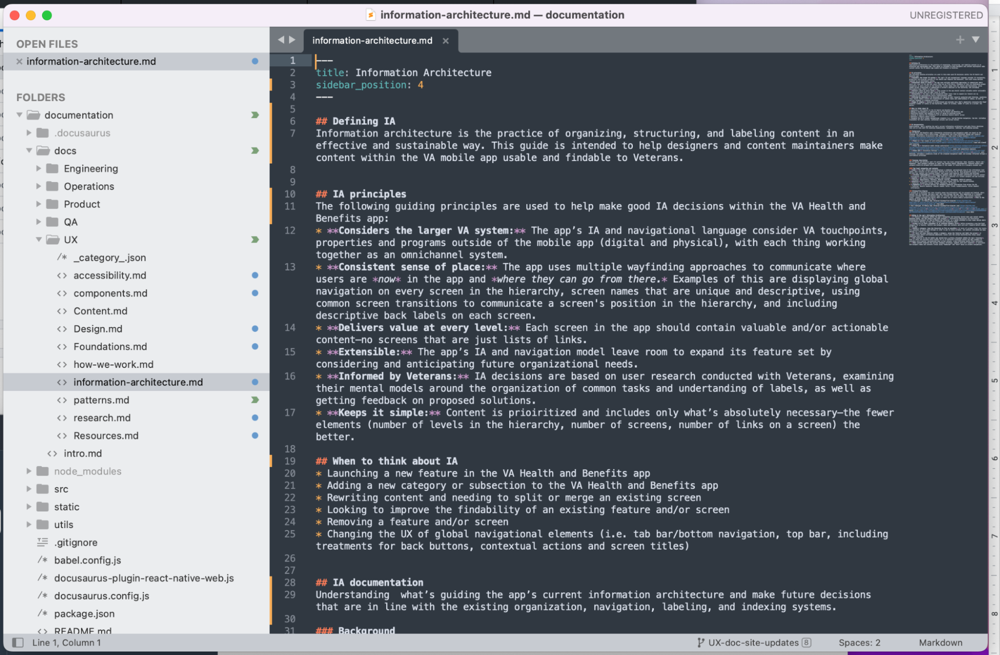

 
Edit the md file and save it, then switch to your browser window to view the changes rendered onscreen. Review updates in your browser as you go to make sure everything looks as you expect.  

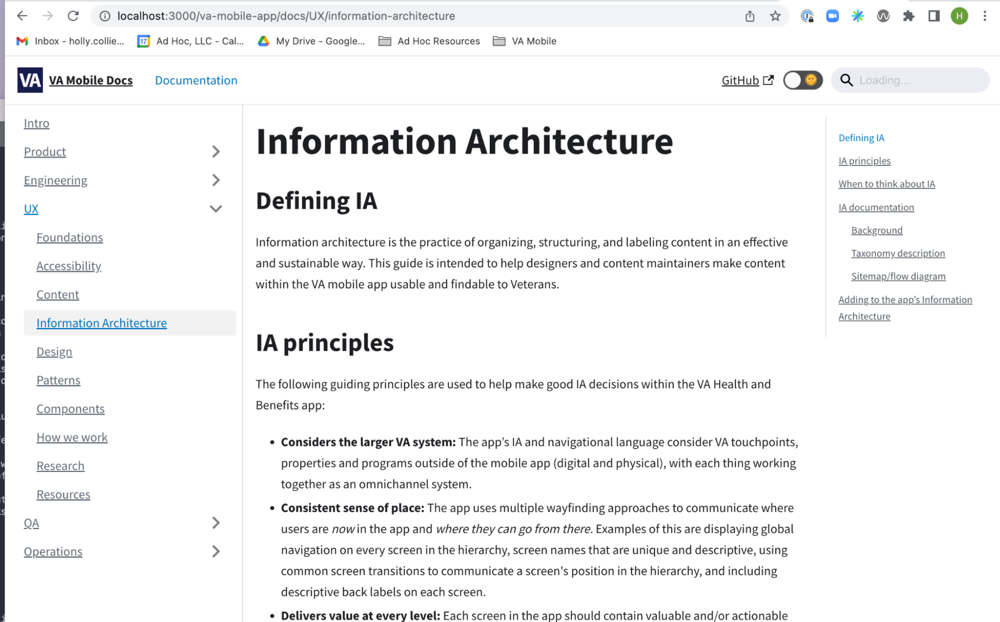

Once you’re happy with all of your edits, it’s time to build the site & submit your changes!

### 5. Build the doc site locally to review changes before publishing

Once you are done editing you need to build the site. This step generates a static version of the site, which is the same as how it is served on the live Doc site. It should look the same as the development environment you have been running.  

First, stop/kill the dev site. To do this, go to **Terminal/Command Line** and type in 
`CTRL + C` to stop/kill the dev site.  

Next, you’re going to build the site. In **Terminal/Command Line,** type in `yarn build `and press enter.  

The site will build and display any errors it finds. Check and make sure everything looks good. Note that if you make changes you will have to run build again to see them, unlike with the development server which auto updates for faster development.  

_If you’d like someone else to review your branch before publishing them, you should commit your changes and publish your branch following the steps below, but don’t create a pull request._

### 6. Publish your changes to the live doc site  

To push your changes to the live Doc site, you first need to check your changes, and get those changes approved by someone else on the team. You can do this by publishing the changes & creating a pull request.  

**Commit changes**  

First, open GitHub Desktop. It will show all of the pages you changed in the Changes tab on the left. If you click on a file, you can see the set of changes for each file (called a diff). Green indicates a line was added. Red indicates the line was deleted.  

Make sure only the boxes next to the pages you want to update are checked. At the bottom of that column, write a summary of the changes you made (in case someone needs to review the history and can easily tell what you were up to) and then click “Commit” to save the changes.  

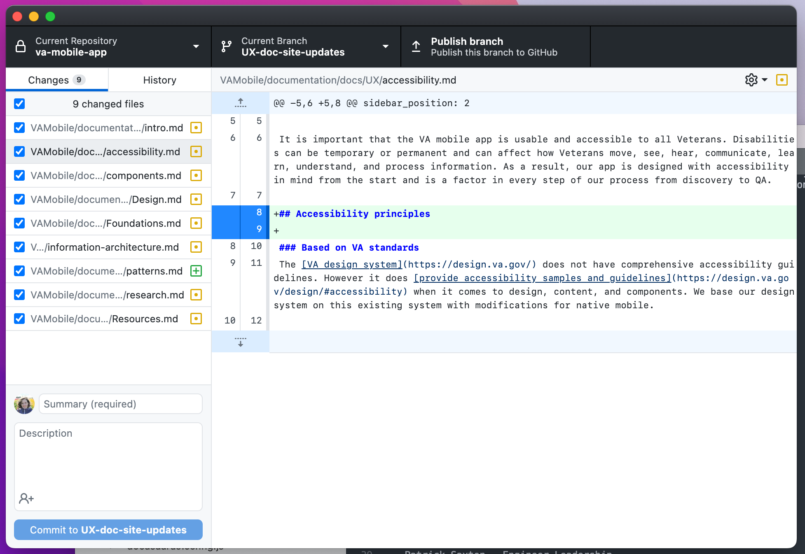

GH Desktop should then show you a screen that says “No local changes” again. If you have more changes or more commits, go ahead and do those now. Once you have all the changes you want to make, you will need to publish your branch so that you can make a pull request.  

**Publish branch**  

In order to make a Pull Request and add your changes back onto the base branch, you will need to copy your local branch up onto the GitHub server. To do this, you just need to go to the GH Desktop app, and click either the Publish Branch tab at the top or the Publish Branch button in the Publish your branch area.  

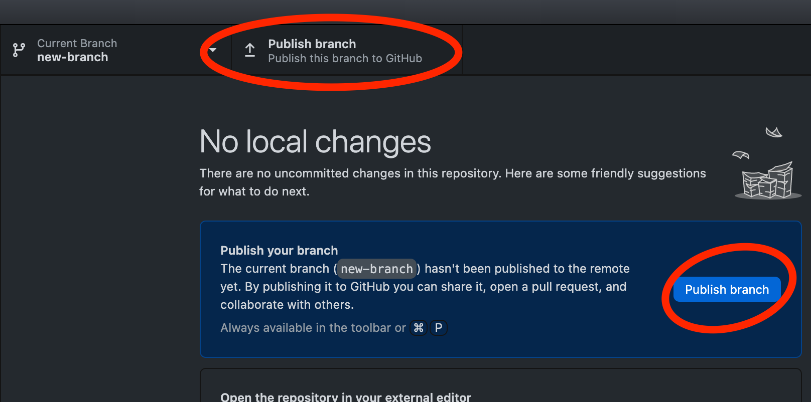

The branch should get pushed up to the repository and you should then see an area to Create Pull Request.  

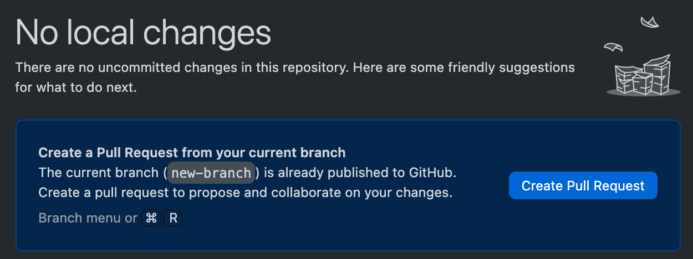

**Create a pull request**  

Click the Create Pull Request button. This should open a browser window that takes you to a Pull Request template in the repository (You can also open the docsite in Github in your browser: [https://github.com/department-of-veterans-affairs/va-mobile-app](https://github.com/department-of-veterans-affairs/va-mobile-app))  

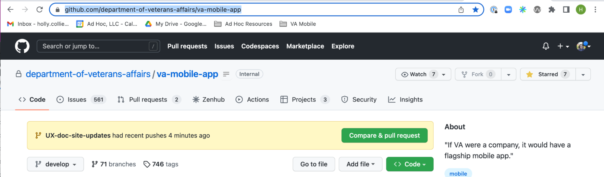

Click “Compare & pull request.” You will see this:  

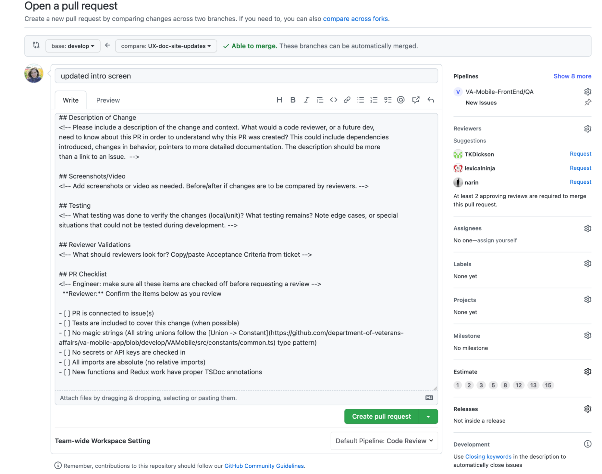

Before you create the pull request, do the following things:  

* Make sure the base is set to “develop” 
* Github will automatically choose reviewers for you, but you can also choose two people to review your request.
* Scroll down to compare the changes between branches.

If all is well, click Click the green “Create pull request” button.  

##### Your PR has been created!  

Wait for it to be reviewed by two team members.  

### 7. Deploying your branch to the doc site 
After your pull request receives two approvals, click the green “merge pull request” button at the bottom of the pull request page in Github, followed by the “confirm merge” button in the next step.

Your branch will then begin deploying to the doc site and will be live once the merge is complete.

* To track the status of the build, click “Actions” in Github.
    - Next, find and select "[Documentation] Deploy Site" in the left-hand panel.
    - The build will have a yellow icon while the branch is deploying to the doc site and a green check icon once it is complete.

### Further reading

* [How to use GitHub Desktop and Sublime text to make pull requests](https://department-of-veterans-affairs.github.io/va-mobile-app/docs/Operations/Making%20Changes/) (General - not specific to Doc site) 
* More info on [how to navigate files and folders in Terminal/Command Line](https://www.macworld.com/article/221277/command-line-navigating-files-folders-mac-Terminal/Command Line.html).
* [Markdown cheatsheet](https://www.markdownguide.org/cheat-sheet/)
