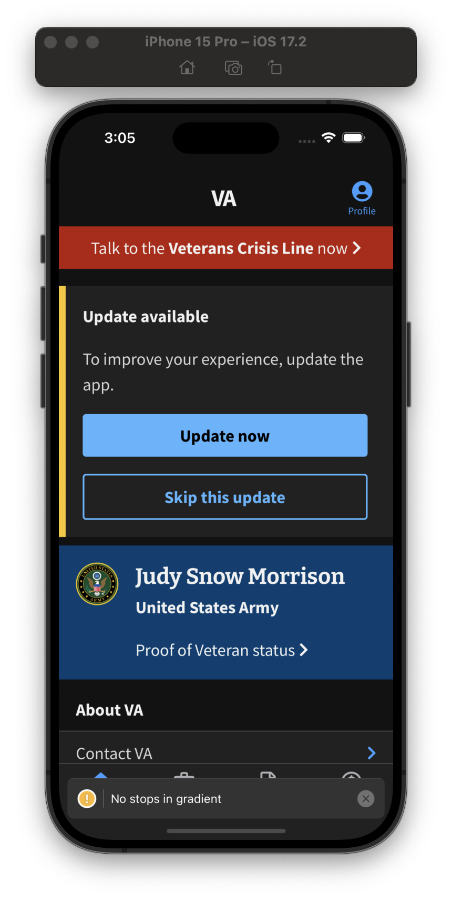

## Feature Summary

Encouraged update displays to the veteran that there is a newer version in the app store to encourage them to update with a button to click to either download in-app updates (Android) or to go to the app store to download (iOS). In doing so, they will download the latest version of the app and have access to all of the benefits that come with it. We also give them the option of skipping an update for a particular version, which hides this alert until the next version is released. This alert takes priority over the What's New alert.

This is potentially a precursor to forced upgrading in the future after so many versions of the app have gone by without upgrading. Currently there is no plan to have a forced upgrade feature, but the ability is there.

## Use Cases

* Use Case 1: The version on the device is older than what is in the store, so it displays the encouraged update alert (see screenshot)
* Use Case 2: The version on the device is older than what is in the store, and the veteran decided to skip the encourage update for this version so it does not display the alert
* Use Case 3: The version on the device is the same version in the store or newer (updates from the app store roll out to devices periodically, so it is possible that the app was updated but the store's API is returning an older version) so it displays the [What's New](../WhatsNew/WhatsNew.md) alert if applicable 

## How to force this to appear in Demo Mode

1. Go to the developer screen in the settings part of the app and scroll to the bottom where it has Encouraged Update and What's New versions
2. Set the Encouraged Update version override to a version that is lower than the store version
3. Logout of the app and log back into demo mode

## Screenshot of an encouraged update

