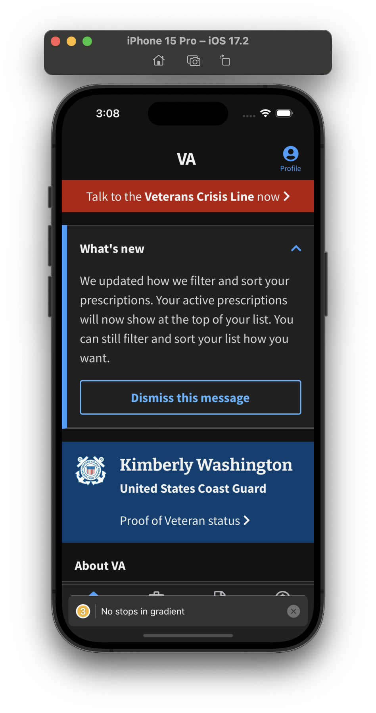
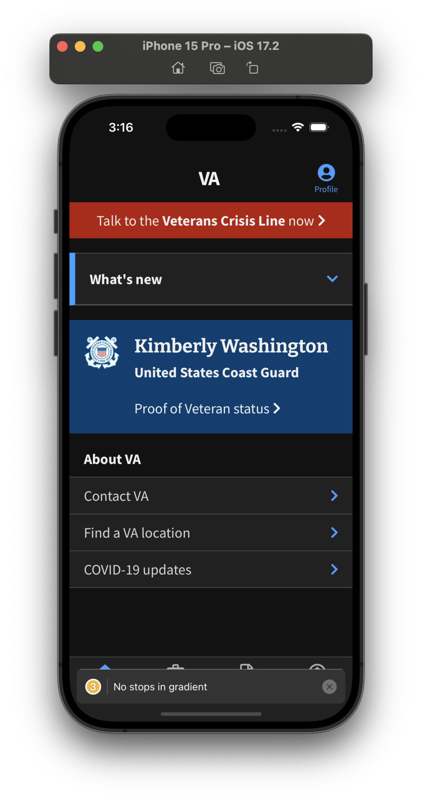

## What's New 2.0, coming soon
### Overview
* Use this [component](https://www.figma.com/proto/3fdJpC7ROpexM9IsBSrezj/What-s-new?page-id=2001%3A429&node-id=4578-2402&p=f&viewport=-4079%2C-1891%2C0.5&t=3Csog9e3E6fvGgIz-1&scaling=scale-down&content-scaling=fixed&starting-point-node-id=4578%3A2402) to inform users of new or updated functionality in the app.
* Content in this component must be short, scannable information that summarizes the new or improved feature that is launching in the app. What’s new is brief by design as to inform users but not add friction to the task they initially came to the app to complete.
* Do not use What’s new to explain how your feature works. 

### When to use
* Your feature is brand new or hasn't existed in the app before.
* You have improved or expanded a current app feature.

### Content overiew & specs 
1. A **header**, summarizing the feature. Specs: character limit (35).
2. A **description**, providing additional detail about the feature. Specs: Character limit (200), bullets (3 max).
3. A **call-to-action**, takeing users directly to the new feature or related content. Specs: Character limit (35).

## Archive 
### Feature Summary

What's new displays to the veteran what is new in the version that they upgraded to. This alert is only shown if the version of the app the user is on is the most recent in the store and if there is a significant change to announce with the provided notes to display to the user. The user can dismiss this alert from reappearing for the current version.

### Use Cases

* Use Case 1: The user is on the most recent version available in the store, and there are notes for the alert to display, resulting in the alert being shown (see screenshot)
* Use Case 2: The user is on the most recent version with notes to display, but the user has dismissed the alert, causing it to no longer be displayed
* Use Case 3: The user has dismissed the alert, but a feature flag or authorized service has been turned on causing 
  just that feature's information to display
* Use Case 4: The user is on a older version of the app and instead sees [Encouraged Update](..
  /EncouragedUpdate/EncouragedUpdate.md)
* Use Case 5: The user is on the most recent version, but there are no notes to be displayed, so there is no alert

### How to display What's New

What's new is displayed based on the WhatsNewConfig, which contains an array of feature names and optional flags and authorized services.

* `featureName` will be mapped to the translation file by convention to display body content, bullet points, and links 
* `featureFlag` will prevent this feature from being displayed unless that flag is on for the user
* `authorizedService` will prevent this feature from being displayed the user has that authorized service
* `bullets` optional value for the number of bullets to show with this entry. Maps to \<featureName\>.bullet.\<number\> 
  translation keys for content
* `hasLink` Whether there is a link to display at the bottom of the entry. Maps to \<featureName\>.link.url and 
  \<featureName\>.link.text

If the user dismisses the What's New alert and a flag or service later enables that feature, it will appear again with that feature's content.

### Example Screenshots of the What's New feature

#### Expanded

#### Not Expanded

