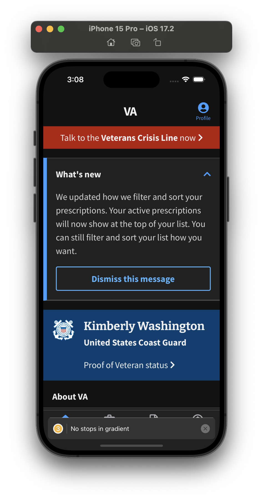
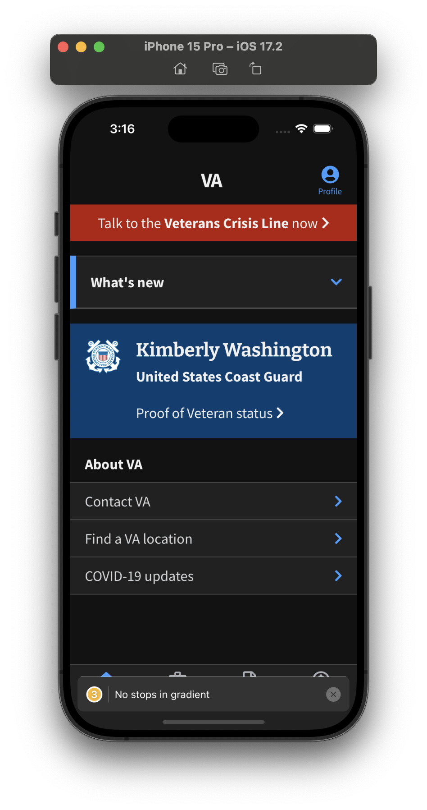

## Feature Summary

What's new displays to the veteran what is new in the version that they upgraded to. This alert is only shown if the version of the app the user is on is the most recent in the store and if there is asignificant change to announce with the provided notes to display to the user. The user can dismiss this alert from reappearing for the current version.

## Use Cases

* Use Case 1: The user is on the most recent version available in the store, and there are notes for the alert to display, resulting in the alert being shown (see screenshot)
* Use Case 2: The user is on the most recent version with notes to display, but the user has dismissed the alert, causing it to no longer be displayed
* Use Case 3: The user is on a older version of the app and instead sees [Encouraged Update](../EncouragedUpdate/EncouragedUpdate.md)
* Use Case 4: The user is on the most recent version, but there are no notes to be displayed, so there is no alert

## How to force this to appear in Demo Mode

1. Go to the developer screen in the settings part of the app and scroll to the bottom where it has Encouraged Update and What's New versions
2. Set the Encouraged Update version override to a version that is equal to or greater than the store version
3. Set the What's New version override to a version that is a valid version in the `common.json` file in the translations folder (Valid versions at the time of writing this are 2.0, 2.2, 2.3, 2.13, and 2.23)
Step 4: Logout of the app and log back into demo mode

## Example Screenshots of the What's New feature

### Expanded

### Not Expanded

