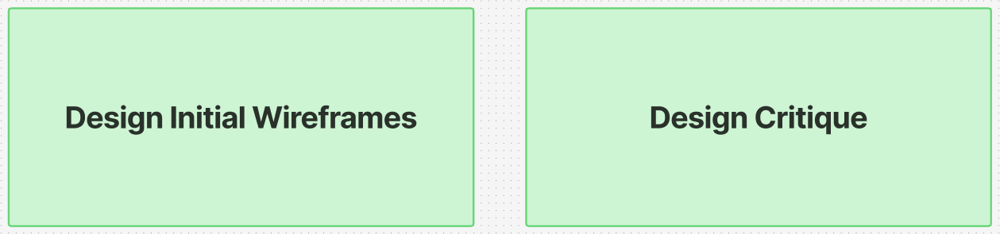
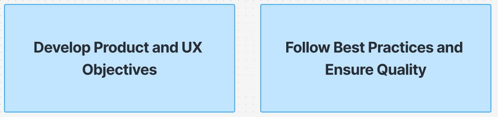
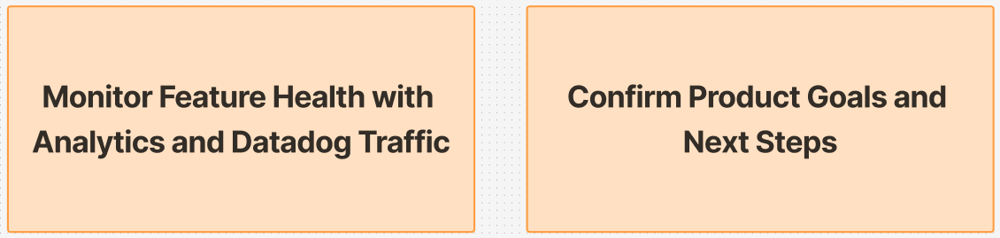
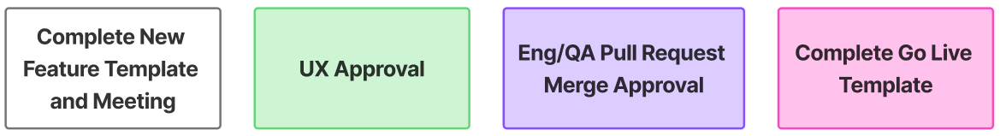

This page provides an overview of the Mobile Workflow Process, including the general flow of the process, activities your team should take in order to develop on mobile, and an outline of the checkpoints needed to obtain Mobile App Platform team approval.
Before engaging in the Mobile Design and Development process, please review the guidance below to help plan and execute your work.

## Should I use the full feature workflow process or the standalone pull request requirements?  
There is no 'minimum speed limit' in regards to applying the steps in the full feature workflow process and engaging the Mobile App Platform team for assistance in your delivery. We suggest any work that extends beyond 1 or 2 reasonably sized pull requests go through the full workflow process in order to potentially head off issues you would face at peer review/UX review. If you have questions about whether you should use the full process or the standalone pull request requirements, feel free to ask in one of our public channels.

-----------
## A: Standalone Pull Request Requirements

* Clearly defined description of change and context regarding the proposed code edits.
* Suggested rollout plan and requirements.
* All associated staging test data and users documented.
* Screenshots of visual changes and video recordings of screen reader traversal on iOS and Android.
* Clearly defined and verbose acceptance criteria.
* Unit tests and e2e tests included for any net new functionality or screens.
* All other engineering best practices followed.

## B: Full Feature Workflow
-----------

-----------  
## Project Kickoff
-----------  
**Purpose**:  
The goal of the Product Kickoff and Approval phase is to get alignment with the Mobile App (Platform) team on what you’re building, why it matters, and what it will require - before you invest heavily in design or engineering.
This phase centers on having a defined problem statement and success criteria, the scope of the work, key dependencies/constraints, how you’ll test it, and how it may impact existing parts of the app (like navigation, notifications, or the homescreen). The outcome is an agreed-upon foundation that the Platform team can support and plan for.  

**Main objectives**:

**During this step feature teams are responsible for:**
* Clearly articulating the problem statement and success criteria
* Identifying a rough sense of scope (what’s in/out) and how the feature should behave
* Discussing technical dependencies/constraints, testing needs, and a high-level timeline

**During this step the Mobile App Platform team will be responsible for:**
* Ensuring feature teams have access to appropriate process documentation
* Identifying any potential hindrances in the development process and future proofing against them
* Setting a Go Live goal and cross modality requirements
* Warning about any potential code or delivery collisions with other teams
* Creating Mobile App Platform team work tied to any homescreen integrations

Please post in the **#va-mobile-app** channel to request a Project Definition Kickoff Meeting and we'll work with you to schedule ASAP.

-----------  
## Design Cycle
-----------  
**Purpose**:  
The goal of the Design Cycle is to get from an early UX direction (lo-fi wireframes) to an approved UI that’s ready for development - while making sure the work aligns with Mobile App Platform standards and won’t collide with other UI patterns.
This step is meant to be collaborative. It gives the Mobile App Platform team an early view into what you’re building, and creates a structured moment to identify risks (process/documentation gaps, potential implementation hurdles, cross-modality needs, delivery collisions, homescreen integration impacts) before the team is too far down the road.

**Main objectives**:

**During this step feature teams are responsible for:**
* Scheduling a design critique meeting [when applicable](../design/About/designers#when-to-attend)
* Getting officially approved signoff on UI and design from the Mobile App Platform team

**During this step the Mobile App Platform team will be responsible for:**
* Helping iterate on proposed designs
* Confirming approved UI for development

-----------  
## Development
-----------   
**Purpose**:  
The goal of the Development phase is to build the product and UX you’ve aligned on, while following Mobile App Platform best practices so the implementation is reliable, accessible, and maintainable.
This phase is where the team turns approved UI/UX into working code—making sure the work meets quality standards (unit/e2e tests, accessibility, backwards compatibility) and fits cleanly into the broader app ecosystem (feature flags, shared components, and platform conventions).  

**Main objectives**:

**During this step feature teams are responsible for:**
* Following development best practices:
    * Avoid NPM Library imports except when absolutely required
    * Keep filtering and sorting logic on the BE code layer for efficient processing
    * Create meaningful unit and e2e tests
    * Add relevant demo mode examples
    * Use translation files for content inclusions
    * Develop for screenreader and other accessibility requirements
    * Use pre-existing components/patterns unless doing so would alter them drastically
    * Ensure backwards compatibility
* Ensuring all work is behind a feature flag unless it can be delivered standalone
* Clarifying any questions with the Mobile App Platform team in the **#va-mobile-app-engineering** channel

**During this step the Mobile App Platform team will be responsible for:**
* Assisting in any onboarding or setup requirements for engineers
* Answering any outstanding questions
* Helping steer development when applicable
* Supplying pre-existing models as a template
* Helping to alter components and processes appwide for new required functionality

-----------  
## Code Review/QA
-----------  
**Purpose**:  
The goal of the Code Review & QA phase is to validate that what was built actually meets the feature objectives, and to ensure that the feature is ready to ship with the right level of quality given Mobile Platform standards.  

**Main objectives**:

**During this step feature teams are responsible for:**
* Creating [pull requests](./SetUp/Pull%20Requests/) that meet engineering and QA requirements
* Supplying meaningful and comprehensive acceptance criteria, accessibility requirements, and staging data
* Responding to peer review change requests and comments
* Engaging in good faith discourse
* Confirming and fixing merge-blocking bugs reported

**During this step the Mobile App Platform team will be responsible for:**
* Ensuring coding best practices have been followed
* Confirming all code is legible and easy to understand
* Suggesting pre-existing alternatives when they exist to avoid wheel remaking and conformity
* Thorough accessibility testing and acceptance criteria confirmation on both Android and iOS devices
* All feedback/bugs described as required or not for merge

-----------  
## Prep for Go-Live
-----------  
**Purpose**:  
The goal of the Prep for Go-Live phase is to make sure the feature is truly ready for release in production - tested end-to-end, fully approved from a UX standpoint, and packaged with the right go-live documentation so that rollout is smooth and low-risk.
This phase is where teams shift from “it works in dev/staging” to “it’s ready for Veterans.” The focus is on regression/production testing, completing go-live readiness documentation, and aligning on rollout and any final QA requirements.  

**Main objectives**:

**During this step feature teams are responsible for:**
* Documenting a production test with Veteran volunteers or requesting the Mobile App Platform team to do so
* Confirming all UX has been approved by the Mobile App Platform PO
* Filling out a [Go-Live Template ticket](https://github.com/department-of-veterans-affairs/va-mobile-app/issues/new?template=Go-Live-Approval-Template.md)
* Responding to any new QA requirements

**During this step the Mobile App Platform team will be responsible for:**
* Regression test all tickets associated with the feature
* Execute a phased rollout upon request
* Add in-app what's new content and release notes when applicable
* Ensure there are no feature collisions with other teams

-----------  
## Monitor Feature
-----------  
**Purpose**:  
The goal of the Monitor Feature phase is to make sure the feature is healthy after go-live, and to confirm you’re actually achieving the product outcomes you set out to deliver.
This phase is about shifting from “we shipped it” to “it’s working in the real world.” You’ll use analytics and Datadog traffic to monitor feature health, gather broader feedback, and make decisions about what happens next (iterate, expand, retire analytics, or plan follow-on work).  

**Main objectives**:

**During this step feature teams are responsible for:**
* Reviewing given analytic solutions for feature health at Go-Live and beyond
* Gathering larger scale feedback regarding feature
* Report any critical issues identified to the Mobile App Platform team ASAP
* Consider analytic retirement or next steps for feature

**During this step the Mobile App Platform team will be responsible for:**
* Report any unique user feedback to the feature team
* Report any critical issues identified to the feature team ASAP

-----------  
## Mobile Platform Approval Steps
-----------  
To create features successfully on the Mobile App Platform, these are the checkpoints every feature team should be moving towards and through:  

